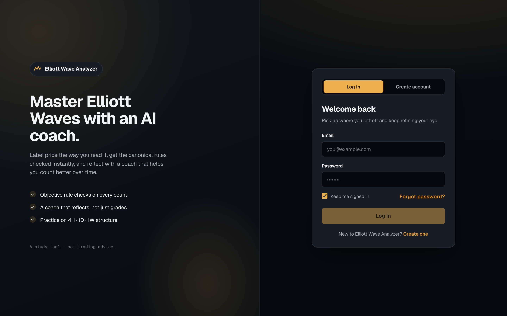
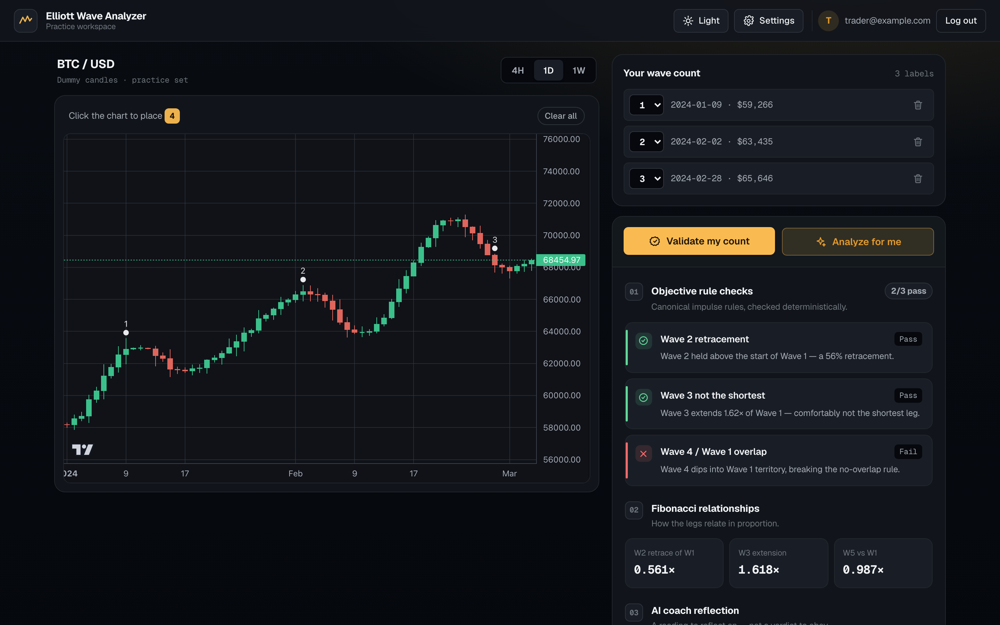
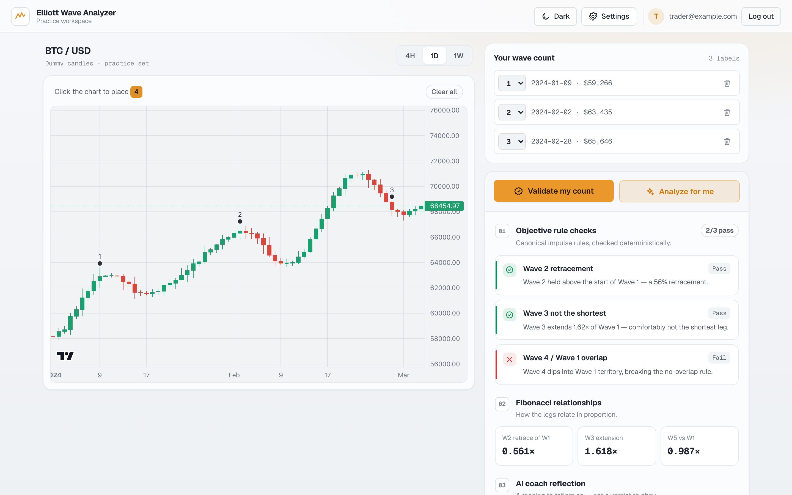
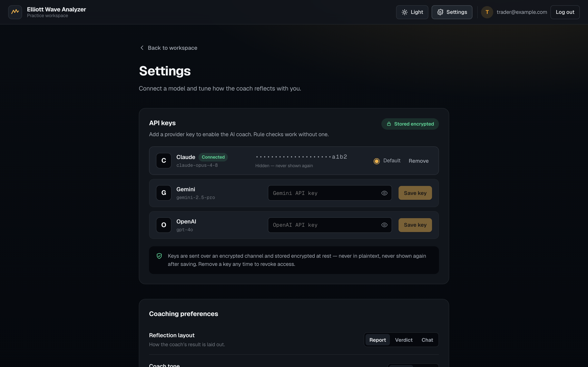

# Elliott Wave Analyzer

A **market-analysis tool built on the Elliott Wave Principle.** Run a full-auto analysis that
detects the wave structure for you and reads the market, or place wave labels (1–5, A/B/C, W/X/Y)
yourself and get the canonical rules checked instantly with an AI analyst's interpretation. Not
financial advice.

[](https://github.com/NexusHero/ElliotWaveAnalyzer/actions/workflows/ci.yml)
[](https://github.com/NexusHero/ElliotWaveAnalyzer/actions/workflows/security.yml)
[](https://github.com/NexusHero/ElliotWaveAnalyzer/actions/workflows/codeql.yml)
[](LICENSE)

## Screenshots

| Sign in — branded, with a clear Log&nbsp;in / Create&nbsp;account switch | Workspace + coach — rule checks, Fibonacci ratios, AI reflection |
|:---:|:---:|
|  |  |

| Workspace (light theme) | Settings — secured per-provider API keys |
|:---:|:---:|
|  |  |

The hero of every screen is the **wave-analysis loop**: run the full-auto analysis to detect and
rank wave counts on live market data, or place a count yourself, validate it against the three
canonical impulse rules, and compare with the AI's reading. Dark and light themes are both
first-class.

## Overview

```
[CoinGecko / Yahoo Finance]
         ↓
  [ASP.NET Core Backend]
  Minimal API · Indicator calculation · LLM coach · PostgreSQL (auth & sessions)
         ↓ JSON (REST)              ↓ PNG (SkiaSharp)
  [React Frontend]              [Telegram / Email]
  TradingView Lightweight Charts
  Interactive Elliott Wave annotation + AI coach
```

## Monorepo structure

```
ElliotWaveAnalyzer/
├── backend/
│   ├── src/
│   │   └── ElliotWaveAnalyzer.Api/   # ASP.NET Core Minimal API (.NET 10)
│   ├── tests/
│   │   └── ElliotWaveAnalyzer.Tests/ # NUnit + NSubstitute
│   └── ElliotWaveAnalyzer.sln
├── frontend/                          # React 18 + TypeScript + Vite
├── docs/screenshots/                  # UI screenshots used in this README
└── README.md
```

## Prerequisites

- .NET 10 SDK
- Node.js 24+
- (Optional) Docker for containerized deployment

## Local dev workflow

### Backend

```bash
cd backend
dotnet restore
dotnet build
dotnet test                          # all tests
dotnet run --project src/ElliotWaveAnalyzer.Api
# API runs on https://localhost:5001
# Swagger UI: https://localhost:5001/swagger
```

### Frontend

```bash
cd frontend
npm install
npm run dev                          # Vite dev server on http://localhost:5173
npm run test                         # Vitest
npm run build                        # Production build (tsc --noEmit + vite build)
```

### OpenAPI codegen (generate TypeScript types from the backend)

```bash
cd frontend
npm run generate:api                 # openapi-typescript → src/api/generated.ts
```

## Continuous integration

Four GitHub Actions pipelines guard every push and pull request to `main`:

| Workflow | File | Trigger | What it does |
|----------|------|---------|--------------|
| **CI** | [`ci.yml`](.github/workflows/ci.yml) | push / PR to `main` | Builds & tests the .NET 10 backend (with a PostgreSQL 17 service for the auth round-trip) and the React/Vite frontend. |
| **Security Scan** | [`security.yml`](.github/workflows/security.yml) | push / PR + weekly cron | `dotnet` NuGet vulnerability audit and npm dependency audit. |
| **CodeQL** | [`codeql.yml`](.github/workflows/codeql.yml) | push / PR + weekly cron | Static analysis for C# and JavaScript/TypeScript. |
| **Release** | [`release.yml`](.github/workflows/release.yml) | `v*` tags | Publishes self-contained backend binaries for linux-x64, win-x64 and osx-x64. |

Dependency updates are automated via [Dependabot](.github/dependabot.yml).

## Architecture decisions

Architecture decisions are documented as ADRs in [`docs/architecture.md`](docs/architecture.md) (ADR-001 … ADR-006).

## Tech stack

| Layer        | Technology                              |
|-------------|-----------------------------------------|
| Backend API | ASP.NET Core Minimal API (.NET 10)      |
| Auth        | ASP.NET Core Identity + opaque session cookies; optional Google OAuth |
| Indicators  | Skender.Stock.Indicators                |
| Charts (srv)| SkiaSharp                               |
| LLM coach   | Claude / Gemini / OpenAI (configurable) |
| Persistence | PostgreSQL via EF Core / Npgsql          |
| Logging     | Serilog (structured JSON)               |
| Frontend    | React 18 + TypeScript + Vite            |
| Charts (UI) | TradingView Lightweight Charts          |
| Tests BE    | NUnit + NSubstitute                     |
| Tests FE    | Vitest + React Testing Library          |

## Deployment

Self-contained single-file as the target; containerization for a Home Assistant add-on is planned.

## Contributing & community

Contributions are welcome! Please read:

- [CONTRIBUTING.md](CONTRIBUTING.md) — dev setup, workflow, and the pull-request checklist
- [CODE_OF_CONDUCT.md](CODE_OF_CONDUCT.md) — our community standards
- [SECURITY.md](SECURITY.md) — how to report a vulnerability

Pull requests use the [PR template](.github/PULL_REQUEST_TEMPLATE.md); bug reports and
feature requests use the [issue templates](.github/ISSUE_TEMPLATE).
