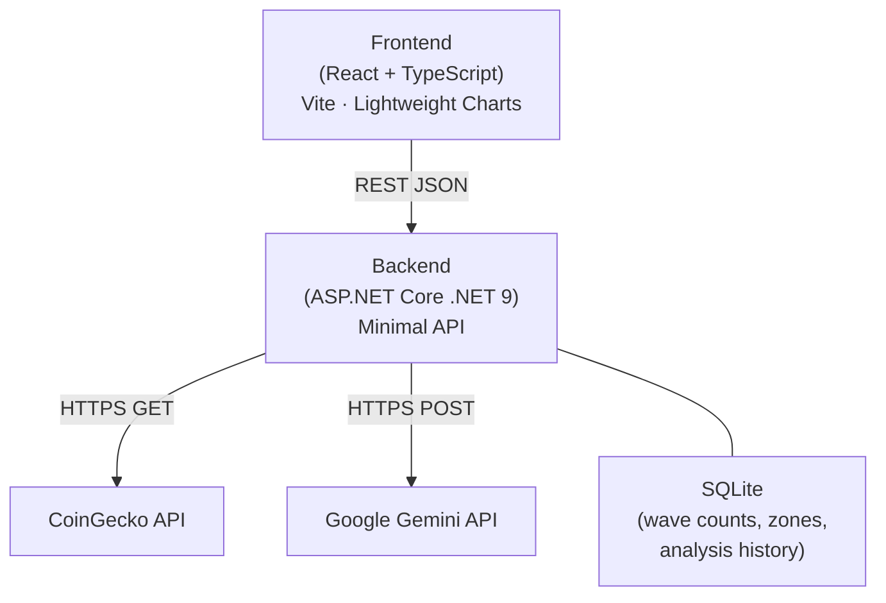
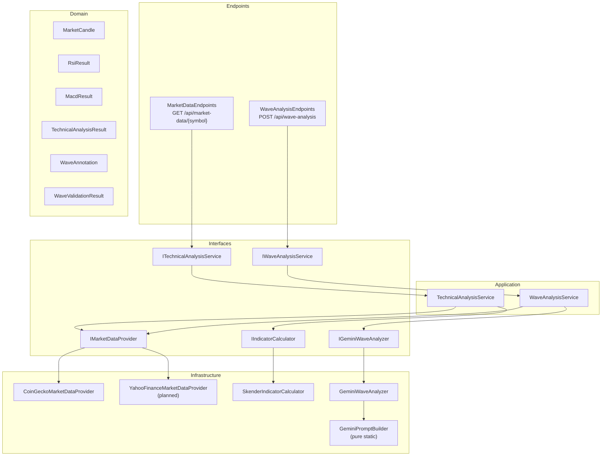
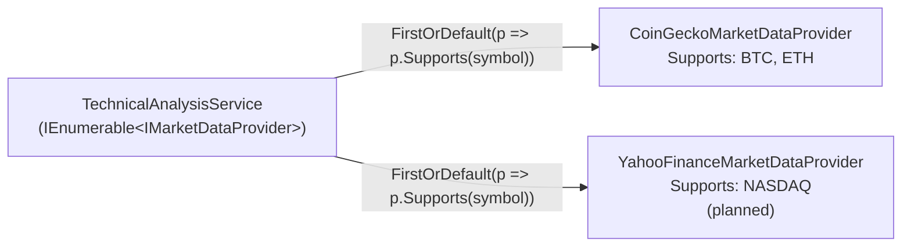
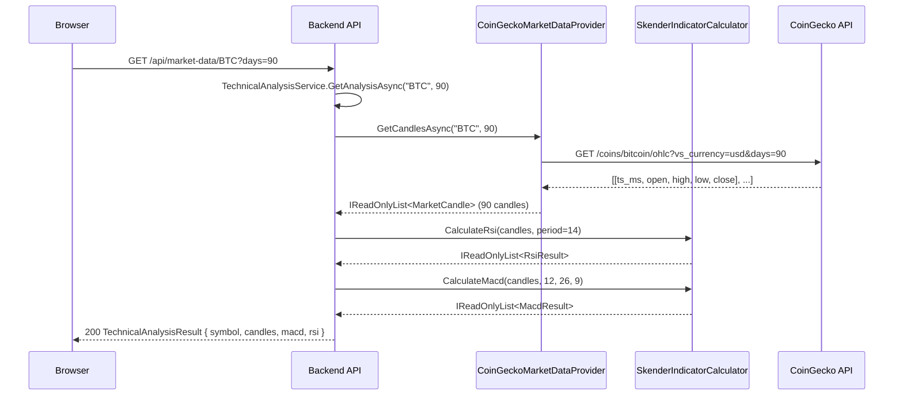
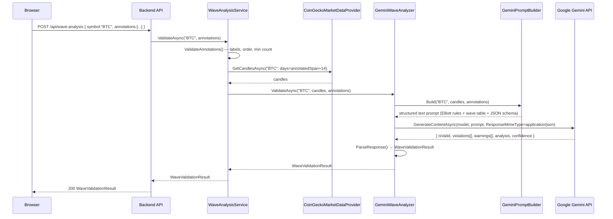
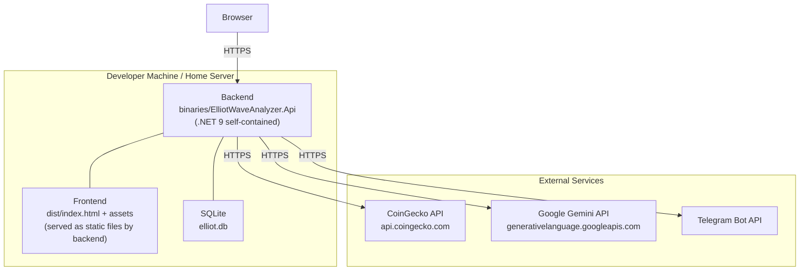
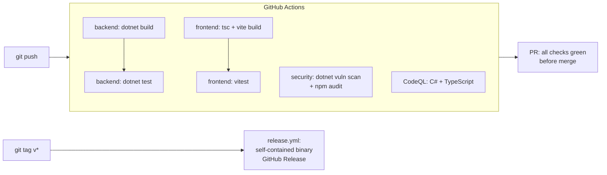

<!-- arc42, the template for documentation of software and system architecture.
     Template Version 9.0-EN, July 2025
     Created, maintained and © by Dr. Peter Hruschka, Dr. Gernot Starke and contributors.
     See https://arc42.org -->

---

# Introduction and Goals {#section-introduction-and-goals}

## Requirements Overview {#_requirements_overview}

**Elliott Wave Analyzer** is a web application for technical analysis of financial markets (BTC, ETH, NASDAQ) based on Elliott Wave Theory. The system provides interactive price charts, pre-computed technical indicators (RSI, MACD), and AI-powered validation of user-drawn Elliott Wave counts via the Google Gemini API.

**The problem:** Elliott Wave analysis is subjective and error-prone. Traders manually annotate turning points on charts and must mentally verify complex rule sets (Wave 3 is never the shortest, Wave 4 must not overlap Wave 1, etc.). A structured AI validation layer reduces annotation errors and provides educational feedback.

**Essential functional requirements:**

| # | Requirement |
|---|-------------|
| F1 | Fetch OHLCV candle data for BTC, ETH (CoinGecko) and NASDAQ (Yahoo Finance) |
| F2 | Calculate RSI and MACD server-side using a verified library (Skender.Stock.Indicators) |
| F3 | Serve candles + indicators as a single JSON response to minimize frontend round-trips |
| F4 | Accept user-placed Elliott Wave annotations (date + price + label) and validate them via Gemini |
| F5 | Return structured validation feedback: hard rule violations, warnings, overall analysis |
| F6 | Render candlestick charts with synchronized MACD/RSI sub-panes in the browser |
| F7 | Support interactive annotation: click-to-label, edit, delete, re-assign |
| F8 | Generate server-side chart images (PNG) for daily report delivery via Telegram/Email |
| F9 | Model name configurable without code change (Google deprecates Gemini versions regularly) |

## Quality Goals {#_quality_goals}

| Priority | Quality Attribute | Goal |
|----------|------------------|------|
| 1 | **Correctness** | Technical indicator calculations (RSI, MACD) must match established reference implementations; Skender handles Wilder's Smoothing edge cases that are easy to get wrong manually |
| 2 | **Extensibility** | New data sources (Yahoo Finance for NASDAQ), new indicators, or new LLM providers must be addable without touching existing classes (OCP) |
| 3 | **Testability** | All business logic sits behind interfaces; infrastructure (CoinGecko, Gemini) is mockable without network access; >80% branch coverage on domain and application layers |
| 4 | **Security** | API keys (CoinGecko Pro, Gemini) must never be hardcoded; configurable via environment variables or appsettings |
| 5 | **Maintainability** | Architecture decisions are documented as ADRs; Gemini model name is a configuration value, not a constant |

## Stakeholders {#_stakeholders}

| Role | Expectations |
|------|-------------|
| **Trader / End User** | Fast chart loading, intuitive wave annotation, clear and actionable Gemini feedback |
| **Developer (Suhay Sevinc)** | Clean SOLID architecture, full test coverage, easy local dev setup |
| **Future Home Assistant Add-on Operator** | Self-contained Docker image, clean REST contract, no hardcoded host coupling |

---

# Architecture Constraints {#section-architecture-constraints}

## Technical Constraints

| Constraint | Background |
|-----------|------------|
| Backend must be .NET 9 | Developer background is C#/.NET; no Node.js or Python backend |
| Indicator calculations must use Skender.Stock.Indicators | Avoids subtle implementation errors in RSI (Wilder's Smoothing), MACD (EMA seeding); library is open-source and well-tested |
| Gemini model name must be configurable | Google regularly deprecates Gemini model versions; changing the model must require only an appsettings update |
| CoinGecko free-tier OHLC endpoint does not provide volume | Volume is set to 0 in returned candles; acceptable because RSI and MACD use Close price only |
| Frontend uses TradingView Lightweight Charts for rendering | Library is rendering-only (no indicator math); all indicator data comes pre-calculated from the backend |
| Self-contained single-file deployment as target | Facilitates future Home Assistant Add-on containerization |

## Organizational Constraints

| Constraint | Background |
|-----------|------------|
| One-person project | No dedicated ops team; architecture must be low-maintenance |
| CI/CD via GitHub Actions | Security scan, build, and test suite run automatically on every push and PR |
| Replaces an n8n workflow | Existing daily report (MACD/RSI + Gemini zones + Telegram/Email) must be replicated; n8n is phased out |
| Open-source (MIT) | All dependencies must be MIT-compatible |

## Conventions

| Convention | Application |
|-----------|-------------|
| Conventional Commits | All git commits follow `type(scope): summary` in English |
| C# Nullable Reference Types | Enabled project-wide; no implicit nullability |
| TypeScript strict mode | Enabled; no `any` without explicit justification |
| SOLID principles | Enforced in all backend service classes |
| TDD | Tests written before implementation; tests cover mathematical properties of indicators |
| arc42 (Markdown) | This documentation |

---

# Context and Scope {#section-context-and-scope}

## Business Context {#_business_context}


| Neighbour System | Relationship | Direction | Protocol |
|-----------------|-------------|-----------|----------|
| **CoinGecko API** | Provides OHLCV data for BTC and ETH | Backend → CoinGecko (pull) | HTTPS GET |
| **Yahoo Finance** | Provides OHLCV data for NASDAQ (planned) | Backend → Yahoo (pull) | HTTPS GET |
| **Google Gemini API** | Validates Elliott Wave counts against the canonical rules | Backend → Gemini (push) | HTTPS POST |
| **Telegram Bot API** | Delivers daily analysis reports as PNG chart images | Backend → Telegram | HTTPS Bot API |
| **SMTP Server** | Delivers daily analysis reports via email | Backend → SMTP | SMTP/TLS |

## Technical Context {#_technical_context}

| Channel | Protocol | Format | Endpoint |
|---------|----------|--------|----------|
| Frontend ↔ Backend | HTTPS | JSON (REST) | `/api/*` |
| Backend → CoinGecko | HTTPS (GET) | JSON (array of arrays) | `api.coingecko.com/api/v3/coins/{id}/ohlc` |
| Backend → Gemini | HTTPS (POST) | JSON (Google.GenAI SDK) | `generativelanguage.googleapis.com` |
| Backend → Telegram | HTTPS | Multipart (PNG) | `api.telegram.org/bot{token}/sendPhoto` |

---

# Solution Strategy {#section-solution-strategy}

| Problem | Decision | Rationale | Quality Goal |
|---------|----------|-----------|--------------|
| Multiple data sources (CoinGecko, Yahoo Finance) | `IMarketDataProvider` interface + chain-of-responsibility selection | New provider = new class + one DI line; no existing code changes | Extensibility (OCP) |
| Indicator calculation | Delegate to Skender.Stock.Indicators behind `IIndicatorCalculator` | Avoids reimplementing Wilder's Smoothing and EMA seeding; Skender types never leak into domain | Correctness, Testability |
| Gemini model deprecations | Model name in `appsettings.json → Gemini:Model` | Changing model requires only config update, no deployment | Maintainability |
| Gemini integration in tests | `IGeminiWaveAnalyzer` interface mocked via NSubstitute | Tests never call Gemini; fast, deterministic, free | Testability |
| Prompt quality | Structured text with wave table + Elliott rules + JSON schema instruction | More precise than image analysis; gives Gemini exact prices and dates | Correctness |
| Frontend indicator rendering | Backend calculates, frontend only renders | TradingView Lightweight Charts is rendering-only; no ambiguity about calculation correctness | Correctness |
| API contract synchronization | OpenAPI codegen (`openapi-typescript`) generates TypeScript interfaces | No manual type maintenance; single source of truth in backend OpenAPI spec | Maintainability |

---

# Building Block View {#section-building-block-view}

## Whitebox Overall System — Level 1 {#_whitebox_overall_system}



| Building Block | Responsibility |
|---------------|----------------|
| **Frontend** | Renders candlestick chart + MACD/RSI sub-panes; handles wave annotation interactions; submits annotations to backend |
| **Backend** | Data fetching, indicator calculation, Gemini orchestration, SQLite persistence, PNG chart generation for reports |
| **CoinGecko API** | OHLCV candle data for BTC and ETH (free tier) |
| **Google Gemini API** | Elliott Wave rule validation via LLM |
| **SQLite** | Persists wave counts, support/resistance zones, and daily analysis history |

## Level 2 — Backend Whitebox {#_white_box_backend}



**Interfaces act as the seam between layers. No application-layer class imports an infrastructure type directly.**

| Component | Responsibility |
|-----------|----------------|
| `MarketDataEndpoints` | HTTP handler: parse request, call service, return JSON or Problem |
| `WaveAnalysisEndpoints` | HTTP handler: deserialize annotations, call service, return validation result |
| `TechnicalAnalysisService` | Select provider by symbol, fetch candles, delegate to calculator |
| `WaveAnalysisService` | Validate annotations, fetch candle context, delegate to Gemini analyzer |
| `CoinGeckoMarketDataProvider` | HTTP GET `/coins/{id}/ohlc`; map JSON arrays to `MarketCandle` |
| `SkenderIndicatorCalculator` | Bridge `MarketCandle` → Skender `IQuote` via private adapter; map results to domain types |
| `GeminiPromptBuilder` | Pure static: assemble structured text prompt from symbol, candles, annotations |
| `GeminiWaveAnalyzer` | Call Gemini via `Google.GenAI` SDK; parse JSON response; map to `WaveValidationResult` |

## Level 3 — Provider Chain (Open/Closed Principle) {#_provider_chain}



Adding a new data source (NASDAQ via Yahoo Finance) requires:
1. A new `YahooFinanceMarketDataProvider : IMarketDataProvider` class
2. One line in `Program.cs`: `builder.Services.AddTransient<IMarketDataProvider, YahooFinanceMarketDataProvider>()`

No existing code is modified (OCP).

---

# Runtime View {#section-runtime-view}

## Scenario 1 — Market Data Request {#_runtime_scenario_1}



## Scenario 2 — Elliott Wave Validation {#_runtime_scenario_2}



## Scenario 3 — Invalid Annotation (Early Return) {#_runtime_scenario_3}


---

# Deployment View {#section-deployment-view}

## Infrastructure Overview {#_infrastructure_overview}



**Target deployment model:** Self-contained single-file .NET binary (`dotnet publish -r linux-x64 --self-contained`). The frontend `dist/` is copied into the binary's static files directory. One process, one port, no runtime dependencies.

**Future:** Docker container as Home Assistant Add-on.

## Build Pipeline {#_build_pipeline}



| Workflow | Trigger | Checks |
|---------|---------|--------|
| `ci.yml` | Push / PR on main | Backend: restore → build → test (NUnit); Frontend: tsc → vitest → vite build |
| `security.yml` | Push / PR / weekly Friday | `dotnet list package --vulnerable`; `npm audit --audit-level=high` |
| `codeql.yml` | Push / PR / weekly Sunday | CodeQL static analysis: C# + JavaScript/TypeScript |
| `release.yml` | Tag `v*` | Self-contained backend binary + frontend build → GitHub Release artifact |

---

# Cross-cutting Concepts {#section-concepts}

## Dependency Injection {#_concept_di}

ASP.NET Core's built-in DI container is used. `Program.cs` is the composition root. All services depend on interfaces only — never on concrete types.

```
Program.cs (composition root)
  ├─ IMarketDataProvider → CoinGeckoMarketDataProvider (Transient)
  ├─ IMarketDataProvider → YahooFinanceMarketDataProvider (Transient, future)
  ├─ IIndicatorCalculator → SkenderIndicatorCalculator (Transient)
  ├─ ITechnicalAnalysisService → TechnicalAnalysisService (Transient)
  ├─ IGeminiWaveAnalyzer → GeminiWaveAnalyzer (Transient)
  └─ IWaveAnalysisService → WaveAnalysisService (Transient)
```

`TechnicalAnalysisService` receives `IEnumerable<IMarketDataProvider>` — all registered providers are injected, and the first that supports the requested symbol is selected.

## Skender Isolation {#_concept_skender}

`Skender.Stock.Indicators` is referenced exclusively in `SkenderIndicatorCalculator.cs`. The Skender `IQuote` interface is bridged via a private nested `SkenderQuoteAdapter` — not visible outside that file. Domain types (`MarketCandle`, `RsiResult`, `MacdResult`) never implement or import Skender interfaces.

This means:
- Skender can be upgraded or replaced without touching any other file.
- Unit tests mock `IIndicatorCalculator` and never depend on Skender behavior.
- Integration tests (in `SkenderIndicatorCalculatorTests`) test mathematical properties, not Skender internals.

## Gemini Isolation {#_concept_gemini}

`Google.GenAI` is referenced exclusively in `GeminiWaveAnalyzer.cs`. All other code depends only on `IGeminiWaveAnalyzer`.

`GeminiPromptBuilder` is a pure static class (no dependencies, no I/O) — fully testable without mocks. `GeminiWaveAnalyzer` deserializes Gemini's JSON response into a private `GeminiResponseDto` and maps it to the domain `WaveValidationResult` before returning.

## Error Handling {#_concept_errors}

| Layer | Strategy |
|-------|----------|
| Invalid annotations | `WaveAnalysisService.ValidateAnnotations()` throws `ArgumentException` before any I/O — no Gemini cost incurred |
| CoinGecko HTTP error | `HttpRequestException` propagates; endpoint returns 502 ProblemDetails |
| Gemini empty/malformed response | `InvalidOperationException` thrown by `GeminiWaveAnalyzer`; endpoint returns 502 ProblemDetails |
| Unsupported symbol | `ArgumentException` from service; endpoint returns 400 ProblemDetails |

## Structured Logging {#_concept_logging}

Serilog (`Serilog.AspNetCore`) is wired via `builder.Host.UseSerilog()`. Configuration is read from `appsettings.json → Serilog` section. Sinks: Console (structured output template). Future: File or Seq sink via config only — no code change required.

## Testing Strategy {#_concept_testing}

| Level | Framework | What is tested |
|-------|-----------|----------------|
| **Indicator unit tests** | NUnit + (no mock needed) | Mathematical properties of RSI/MACD (range, trend direction, histogram invariant, date alignment) |
| **Service unit tests** | NUnit + NSubstitute | Orchestration logic: provider selection, delegation, result pass-through, input validation |
| **Prompt builder unit tests** | NUnit (pure) | Prompt content: symbol present, labels listed, prices listed, Elliott rules referenced, JSON schema requested |
| **Frontend component tests** | Vitest + React Testing Library | PriceChart renders without crashing; accepts candles prop |

All tests follow the `Subject_StateUnderTest_ExpectedBehaviour` naming convention.

## API Contract Synchronization {#_concept_api_contract}

OpenAPI spec is served by the backend at `/swagger/v1/swagger.json`. TypeScript interfaces for the frontend are generated via:

```bash
cd frontend && npm run generate:api
# Reads: http://localhost:5001/swagger/v1/swagger.json
# Writes: src/api/generated.ts
```

No manual type maintenance is needed; the backend OpenAPI spec is the single source of truth.

---

# Architecture Decisions {#section-design-decisions}

## ADR-001: SOLID Interfaces for All Cross-Layer Boundaries

**Context:** A single-developer project risks collapsing into a "big ball of mud" without disciplined structure.

**Decision:** Every cross-layer dependency goes through an interface. Infrastructure classes (`CoinGeckoMarketDataProvider`, `SkenderIndicatorCalculator`, `GeminiWaveAnalyzer`) implement interfaces defined in the `Interfaces/` layer. Application services depend only on those interfaces.

**Consequences:**

| | |
|---|---|
| (+) | Every infrastructure dependency is mockable in tests without network access |
| (+) | New providers/calculators/analyzers can be added without modifying existing classes (OCP) |
| (-) | More files than a simple, linear implementation |

---

## ADR-002: Skender.Stock.Indicators instead of Custom RSI/MACD

**Context:** RSI uses Wilder's Smoothing (exponential, non-simple), not a plain moving average. The warm-up period, the seeding convention, and the smoothing alpha all differ from textbook descriptions. MACD EMA seeding is similarly subtle.

**Decision:** Use `Skender.Stock.Indicators` (NuGet) for all indicator calculations. Do not implement RSI or MACD manually.

**Consequences:**

| | |
|---|---|
| (+) | Correct Wilder's Smoothing; tested against known reference data by the library maintainers |
| (+) | `SkenderIndicatorCalculator` is the only file that references Skender — easy to replace |
| (-) | External dependency; must monitor for breaking changes on major version bumps |

---

## ADR-003: Text-based Gemini Prompt instead of Chart Image Upload

**Context:** A chart image could be uploaded to Gemini's multimodal API for visual wave analysis.

**Decision:** Send wave annotations and candle context as structured text (markdown table with prices, dates, Δ% between waves) instead of an image.

**Consequences:**

| | |
|---|---|
| (+) | Exact numeric data — Gemini can compute wave ratios precisely |
| (+) | Lower cost (no image tokens) and faster response |
| (+) | `GeminiPromptBuilder` is pure and fully unit-testable |
| (-) | No visual chart context — Gemini cannot detect local trend structures not captured in the annotations |

---

## ADR-004: ResponseMimeType = "application/json" for Gemini

**Context:** By default Gemini may return markdown-fenced JSON or prose mixed with JSON, making parsing fragile.

**Decision:** Set `GenerateContentConfig.ResponseMimeType = "application/json"` on every Gemini request.

**Consequences:**

| | |
|---|---|
| (+) | Gemini is guaranteed to return raw JSON; no markdown fence stripping required |
| (+) | `System.Text.Json.JsonSerializer.Deserialize<T>()` works directly on the response |
| (-) | If the model does not support `ResponseMimeType`, the request fails rather than returning partial output |

---

## ADR-005: Multiple IMarketDataProvider Registrations with Chain-of-Responsibility Selection

**Context:** BTC/ETH come from CoinGecko; NASDAQ will come from Yahoo Finance. A factory pattern or conditional branching inside the service would require code changes for every new source.

**Decision:** Register all `IMarketDataProvider` implementations in DI. `TechnicalAnalysisService` receives `IEnumerable<IMarketDataProvider>` and selects the first provider whose `Supports(symbol)` returns true.

**Consequences:**

| | |
|---|---|
| (+) | Adding Yahoo Finance = one new class + one DI registration; zero changes to `TechnicalAnalysisService` |
| (+) | Provider selection logic is trivially testable via `Supports()` |
| (-) | Symbol routing is implicit (first-match); symbol ambiguity between providers must be avoided by convention |

---

## ADR-006: GeminiOptions with Configurable Model Name

**Context:** Google releases and deprecates Gemini model identifiers frequently (e.g. `gemini-1.5-flash` → `gemini-2.0-flash` → `gemini-2.5-flash`).

**Decision:** Model name is bound from `appsettings.json → Gemini:Model` via `IOptions<GeminiOptions>`. Default is `gemini-2.5-flash`.

**Consequences:**

| | |
|---|---|
| (+) | Model update requires only an appsettings change, no code deployment |
| (+) | Different environments (dev/prod) can use different models via environment-specific overrides |
| (-) | Operator must remember to update the model name when Google deprecates the current version |

---

# Quality Requirements {#section-quality-scenarios}

## Quality Scenarios {#_quality_scenarios}

| ID | Attribute | Stimulus | Expected Response | Metric |
|----|-----------|----------|-------------------|--------|
| Q1 | Correctness | User calculates RSI on 30 days of BTC data | RSI values fall in [0, 100]; RSI > 99 after 20 consecutive up-days | Test: `CalculateRsi_AllGains_RsiApproachesOneHundred` |
| Q2 | Correctness | MACD Histogram is queried | Histogram = MacdLine − SignalLine for every non-null entry | Test: `CalculateMacd_Histogram_EqualsLine_MinusSignal` |
| Q3 | Extensibility | Developer adds NASDAQ support | New class `YahooFinanceMarketDataProvider` + one DI line; existing tests still pass | No existing file modified |
| Q4 | Testability | Developer runs `dotnet test` | All tests pass without network access; no real Gemini or CoinGecko calls | All tests use NSubstitute mocks or deterministic fixture data |
| Q5 | Security | Gemini API key must be configured | Key read from `appsettings.json` or env var `Gemini__ApiKey`; never hardcoded in source | No literal API key string in codebase |
| Q6 | Maintainability | Google releases `gemini-3.0-flash` | Update `appsettings.json → Gemini:Model`; restart | Zero code changes required |
| Q7 | Correctness | User submits annotations with invalid label "6" | 400 Bad Request with clear error message; Gemini not called | Test: `ValidateAsync_InvalidLabel_ThrowsArgumentException` |
| Q8 | Correctness | Annotations submitted in wrong chronological order | 400 Bad Request; Gemini not called | Test: `ValidateAsync_AnnotationsNotChronological_ThrowsArgumentException` |

---

# Risks and Technical Debt {#section-technical-risks}

## Risks

| ID | Risk | Probability | Impact | Mitigation |
|----|------|-------------|--------|------------|
| R1 | CoinGecko changes OHLC response format without notice (free tier, undocumented SLA) | Medium | High | Catch `JsonException` in provider; return 502; fix `List<List<double>>` mapping |
| R2 | Google deprecates `gemini-2.5-flash` without warning | Low | Medium | Model name is configurable; update appsettings without deployment |
| R3 | Skender major version introduces breaking changes to `IQuote` or extension methods | Low | Medium | Skender isolated in single file (`SkenderIndicatorCalculator.cs`); fix in one place |
| R4 | CoinGecko free-tier rate limits (10–30 req/min) exceeded in multi-user scenario | Low | Low | Add response caching (IMemoryCache); not yet implemented |
| R5 | Gemini returns malformed JSON despite `ResponseMimeType` | Low | Low | `GeminiWaveAnalyzer` catches `JsonException` and throws `InvalidOperationException` → 502 |

## Technical Debt

| ID | Debt | Priority | Effort | Description |
|----|------|----------|--------|-------------|
| S1 | Yahoo Finance provider not yet implemented | High | Medium | NASDAQ support promised; `IMarketDataProvider` is ready; only the implementation is missing |
| S2 | SQLite persistence not yet implemented | High | Medium | Wave counts and daily reports need persistence; planned for next milestone |
| S3 | Frontend wave annotation layer missing | High | High | Core feature (click-to-label on chart) not yet built; `PriceChart` renders candles only |
| S4 | Server-side PNG chart generation (SkiaSharp) not yet implemented | Medium | Medium | Needed for Telegram/Email daily report; SkiaSharp dependency already planned |
| S5 | No response caching for CoinGecko | Low | Low | Every request hits CoinGecko; add `IMemoryCache` with short TTL |
| S6 | OpenAPI codegen not yet automated in CI | Low | Low | `npm run generate:api` must be run manually; add to CI after backend stabilizes |

---

# Glossary {#section-glossary}

| Term | Definition |
|------|-----------|
| **arc42** | Architecture documentation template by Dr. Peter Hruschka and Dr. Gernot Starke; Version 9.0, July 2025 |
| **ADR** | Architecture Decision Record — a short document capturing a significant architectural decision and its rationale |
| **Elliott Wave** | A theory of technical market analysis describing recurring fractal wave patterns in price movements, developed by Ralph Nelson Elliott |
| **EMA** | Exponential Moving Average — a moving average that gives more weight to recent prices |
| **iSAQB** | International Software Architecture Qualification Board — certification body for software architects |
| **MACD** | Moving Average Convergence/Divergence — a trend-following momentum indicator; MacdLine = FastEMA(12) − SlowEMA(26); SignalLine = EMA(9) of MacdLine |
| **OHLCV** | Open, High, Low, Close, Volume — the five standard fields of a price candle |
| **OCP** | Open/Closed Principle — software entities should be open for extension, closed for modification |
| **RSI** | Relative Strength Index — a momentum oscillator (range 0–100) developed by J. Welles Wilder; uses Wilder's Smoothing (not simple moving average) |
| **Skender.Stock.Indicators** | Open-source .NET library for technical indicator calculation; used for RSI and MACD to avoid subtle implementation errors |
| **SOLID** | Five object-oriented design principles: Single Responsibility, Open/Closed, Liskov Substitution, Interface Segregation, Dependency Inversion |
| **TDD** | Test-Driven Development — tests are written before the implementation; Red → Green → Refactor cycle |
| **Wilder's Smoothing** | The exponential smoothing method used in RSI, with smoothing factor α = 1/period (not the standard EMA formula) |
| **Wave Annotation** | A user-placed point on the price chart marked with an Elliott Wave label (1–5 for impulse, A/B/C for correction, W/X/Y for complex correction) |
| **WaveValidationResult** | The structured Gemini response: `isValid`, `violations[]`, `warnings[]`, `analysis`, `confidence` |
