<!-- arc42, the template for documentation of software and system architecture.
     Template Version 9.0-EN, July 2025
     Created, maintained and © by Dr. Peter Hruschka, Dr. Gernot Starke and contributors.
     See https://arc42.org -->

---

# Introduction and Goals {#section-introduction-and-goals}

## Requirements Overview {#_requirements_overview}

**Elliott Wave Analyzer** is a web application for technical analysis of financial markets (BTC, ETH, NASDAQ) based on Elliott Wave Theory. The system provides interactive price charts, pre-computed technical indicators (RSI, MACD), and AI-powered validation of user-drawn Elliott Wave counts via the Google Gemini API.

**The problem:** Elliott Wave analysis is subjective and error-prone. Traders manually annotate turning points on charts and must mentally verify complex rule sets (Wave 3 is never the shortest, Wave 4 must not overlap Wave 1, etc.). A structured AI validation layer reduces annotation errors and provides educational feedback.

**Essential functional requirements:**

| # | Requirement |
|---|-------------|
| F1 | Fetch OHLCV candle data for BTC, ETH (CoinGecko) and NASDAQ (Yahoo Finance) |
| F2 | Calculate RSI and MACD server-side using a verified library (Skender.Stock.Indicators) |
| F3 | Serve candles + indicators as a single JSON response to minimize frontend round-trips |
| F4 | Accept user-placed Elliott Wave annotations (date + price + label) and validate them via Gemini |
| F5 | Return structured validation feedback: hard rule violations, warnings, overall analysis |
| F6 | Render candlestick charts with synchronized MACD/RSI sub-panes in the browser |
| F7 | Support interactive annotation: click-to-label, edit, delete, re-assign |
| F8 | Generate server-side chart images (PNG) for daily report delivery via Telegram/Email |
| F9 | Model name configurable without code change (LLM providers deprecate model versions regularly) |

## Requirements Register {#_requirements_register}

Living register of tracked requirements. Every feature/story is entered here with a stable
`REQ-NNN` id; when it is fulfilled it gains a Runtime-View sequence diagram (§6) showing how it
was implemented. See the **Architecture Governance** section of the `elliottwave-agents` skill for
the process. GitHub issues are where a requirement is discussed; this table is where it is tracked.

| ID | Requirement | Delivered by | Status |
|----|-------------|-------------|--------|
| REQ-001 | Deterministic, provider-agnostic LLM access so providers can be swapped/added without touching domain logic | #67, #68 · ADR-008 | Fulfilled |
| REQ-002 | Detect nested, multi-degree Elliott Wave counts (impulses, diagonals, corrective patterns) deterministically; the LLM only ranks & explains | #76 (PR #75) · ADR-009 | Fulfilled |
| REQ-003 | Surface the nested count (subdivisions, degree, score) in the auto-analysis UI | #77 (PR #78) | Fulfilled |
| REQ-004 | Persist analyses per user and evaluate each outcome (held / invalidated / target reached) against real price action | #79 (PR #80) · ADR-010 · §6 Scenario 4 | Fulfilled |
| REQ-005 | Architecture governance: mandatory ADRs, requirements register, per-change sequence diagrams, ≥90% coverage | #81 (PR #82) · ADR-007 | Fulfilled |
| REQ-006 | Track-record history UI + save action in the auto-analysis panel | #83 (PR #84) · §6 Scenario 5 | Fulfilled |
| REQ-007 | Scheduled re-evaluation + price alerts when an invalidation is touched | #89 · ADR-012 · §6 Scenario 6 | Fulfilled |
| REQ-008 | LLM-confidence calibration against recorded track-record outcomes | #91 · §6 Scenario 7 | Fulfilled |
| REQ-009 | SOLID, TDD and documented+tested API endpoints as enforced Quality Gates | #85 · ADR-011 | Fulfilled |
| REQ-010 | Timeframe selector (Daily/Weekly via resampling; 4H needs an intraday source) | #93 · ADR-013 | Fulfilled |
| REQ-011 | 4-hour timeframe via an intraday-capable market-data provider | #116 · ADR-022 · §6 Scenario 9 | Fulfilled |
| REQ-012 | Per-user encrypted API-key vault (replace the localStorage facade) | #96 · ADR-014 | Fulfilled |
| REQ-013 | Consume the per-user stored key in the LLM pipeline: the active-provider `IChatClient` is resolved per request against the calling user's decrypted key for that provider, falling back to the operator's startup key when the user has none (or the request has no authenticated user); the key is decrypted only to build the client and never logged | #149 · ADR-031 · §6 Scenario 18 | Fulfilled |
| REQ-014 | Genuinely reach ≥90% line coverage and make the CI coverage gate blocking (with a documented exclusion policy) | #99 (PR #100) · ADR-015 | Fulfilled |
| REQ-015 | Route ATR through `IIndicatorCalculator`/Skender instead of a hand-rolled Wilder recurrence | #101 · ADR-016 | Fulfilled |
| REQ-016 | Import a broker depot from a file via pluggable per-broker importers (Smartbroker+ PDF first) | #103 · ADR-017 · §6 Scenario 8 | Fulfilled |
| REQ-017 | Deduplicate the cron scheduler loops behind a shared `CronBackgroundService` base | #105 · ADR-018 | Fulfilled |
| REQ-018 | Scalable Capital depot import from the transactions CSV (second `IDepotImporter`) | #107 · ADR-019 | Fulfilled |
| REQ-019 | One top-level type per file, enforced by an architecture test | #109 · ADR-020 | Fulfilled |
| REQ-020 | Persist the imported depot per user (upsert) + read it back | #111 · ADR-021 | Fulfilled |
| REQ-021 | Resolve arbitrary instruments (ticker/name/ISIN) and analyze them on 1H/4H/1D/1W | #116 · ADR-022 · §6 Scenario 9 | Fulfilled |
| REQ-022 | Log-correct Fibonacci math and scored confluence zones ("green boxes") attached to every projection; scale auto-selected and always reported | #117 · ADR-023 · §6 Scenario 10 | Fulfilled |
| REQ-023 | Top-down multi-timeframe consistency: each finer count constrained to the wave unfolding on the timeframe above it (hard reject on wrong direction, soft penalty on class/window), with a per-link verdict | #118 · ADR-024 · §6 Scenario 11 | Fulfilled |
| REQ-024 | Scenario tree per saved analysis (primary + alternates) with calibrated probabilities (or an insufficient-data marker), zone-entry alerts, and auto-switch to the best alternate on invalidation with an append-only switch history | #119 · ADR-025 · §6 Scenario 12 | Fulfilled |
| REQ-025 | Channel projections (base 0→2 and acceleration 2→4 with a projected wave-5 band) added to every projection, plus a publication-grade annotated chart PNG for any saved analysis (`GET /api/analyses/{id}/chart.png`) via a backend-agnostic draw-op seam and a confined SkiaSharp backend; the LLM still does no geometry | #120 · ADR-026 · §6 Scenario 13 | Fulfilled |
| REQ-026 | Backtest harness that replays the whole deterministic pipeline over history with a structurally-enforced no-lookahead guarantee, aggregates measured scenario hit rates (by structure/confidence/confluence/timeframe), persists them idempotently, exposes `GET /api/backtest/summary`, and feeds the rates back as priors for scenario probabilities | #121 · ADR-027 · §6 Scenario 14 | Fulfilled |
| REQ-027 | Portfolio auto-commentary: `GET /api/depot/analysis` reviews each imported holding — resolve ISIN → top-down count → scenario geometry → optional fact-checked LLM narrative — with a portfolio summary and an explicit unresolved list; narrative degrades gracefully (no key / failed fact-guard); results cached per (position, day); opt-in scheduled refresh | #122 · ADR-028 · §6 Scenario 15 | Fulfilled |
| REQ-028 | Vision import: `POST /api/wave-analysis/verify-image` extracts a claimed count from an uploaded chart with a vision LLM (strict JSON + one retry), snaps every claimed pivot to a real candle extreme (hallucination guard; too few → `ExtractionUnreliable`), runs the deterministic rules on what survives, and compares side-by-side with our own count; image never persisted | #123 · ADR-029 · §6 Scenario 16 | Fulfilled |
| REQ-029 | Setup scanner: `GET /api/scan` sweeps a set of symbols (configured universe or request-supplied) with the deterministic pipeline and returns ranked hits (in-zone → higher score → tighter risk) with structure/score/zone flags; filters (structure/minScore/inZone); bounded concurrency + per-(symbol,day) cache; no LLM; coverage reported (scanned/matched) | #148 · ADR-030 · §6 Scenario 17 | Fulfilled |
| REQ-030 | Risk layer: `POST /api/risk` turns a count's geometry (entry, the invalidation as the stop, target prices, direction) plus an account-risk input (percent of equity or absolute) into stop distance (abs + %), reward:risk per target, and the position size that risks exactly the chosen capital; direction-aware; an entry on the wrong side of the invalidation → explicit `hasValidStop:false` (never a negative/infinite size), non-positive risk keeps the stop/R:R but omits the size; pure arithmetic, no LLM; "not trading advice" | #150 · ADR-032 · §6 Scenario 19 | Fulfilled |
| REQ-031 | Analyst-in-the-loop editing: the chart supports add/move/delete/relabel of pivots (placement + nudge snap to real candle extremes) and `POST /api/wave-analysis/verify` re-runs the **deterministic** pipeline on the edited set — snap, hard rules, projections/zones/invalidation/channels, guideline score — returning the objective read live on every (debounced) edit; no LLM in the loop (it only narrates afterwards); the edited count reuses the existing track-record persistence and annotated-chart export | #151 · ADR-033 · §6 Scenario 20 | Fulfilled |
| REQ-032 | Test strategy: the safety invariants are encoded as **property-based + metamorphic** tests (CsCheck) that attack the pure deterministic core with thousands of generated, shrunk variants — sizing never negative/underflowing, no-valid-stop ⇔ the direction guard, verifier never throws + snapped pivots ⊆ real candles + valid ⇔ no hard-rule fail, snap idempotence, determinism, rule-verdict invariance under price-scaling and time-shift, **no-lookahead** (poisoned future candles never change the windowed analysis), and **LLM-swap invariance** (swapping the model's entire output leaves the deterministic fields byte-identical, proving I1 end to end); generators emit only valid fixtures; the wider layers (adversarial corpus, mutation, browser-E2E, contract-drift, real-LLM eval, load) are tracked as their own issues | #192, #193 (epic #201) · ADR-034 | Fulfilled (foundation) |
| REQ-033 | Mutation testing gate: **Stryker** runs **nightly** over the pure algorithmic core (`Application/**` minus the acceptance-tested orchestration services, plus `Domain/CandleWindow`), rewriting it with small faults and failing if the **mutation score** falls below an enforced **`thresholds.break` floor** — proving the suite would actually *catch* a regression, not merely execute the line (the answer coverage can't give). The pre-4.x config (invalid in Stryker 4.16) is corrected to the 4.16 schema so a local run and CI share one gate; the run is scoped (string/LINQ mutations ignored) to stay bounded, and every surviving mutant is surfaced (HTML/JSON artifact + Markdown into the job summary) with its file, line and mutation | #195 (epic #201) · ADR-035 (+ ADR-015) | Fulfilled |
| REQ-034 | Historical-analog retrieval (deterministic core): for a formed count, a **deterministic feature vector** (structure, direction, guideline score, confluence strength, reward:risk, distance-to-invalidation, RSI/MACD regime) fingerprints the setup; a pure **k-nearest retrieval** finds the most similar *past* setups by cosine over those vectors, restricted to ones that **concluded strictly before** the query's as-of date (**no-lookahead**) and **only concluded** (pending never counted); a pure **aggregator** computes hit-rate, target/invalidated split and median resolution time **only from concluded analogs**, flagging "insufficient history" below a minimum; an **analog fact-guard** rejects any narrative citing a rate/count/date not in the computed report. Wired end to end: an on-demand corpus is swept from the symbol's own history (cached per day), **`GET /api/wave-analysis/analogs`** returns the ranked analogs + measured stats, a **fact-guarded** LLM narrator adds an optional grounded summary (degrading to a reason with no key), and a **Historical analogs** panel presents it | #182 (epic #191) · ADR-037 (+ ADR-009/ADR-027/ADR-028) · §6 Scenario 21 | Fulfilled |
| REQ-035 | Alternate-hypothesis generation: the LLM **proposes** which Elliott structures are worth testing (from a bounded vocabulary — impulse, diagonal, zigzag, flat, triangle), each with a one-line reason; the **deterministic engine generates + rule-checks** each proposal over the detected pivots with the same positional checkers the beam parser uses, scoring survivors with the shared guideline scorer. An **out-of-vocabulary** proposal is rejected **before** generation; a **rule-violating** proposal is rejected with the specific failing rule and **never** presented as valid; the number tested is **capped** (no unbounded prompting) and logged when hit; validation/scoring is **deterministic** and reproducible; with **no LLM key** the feature is simply absent (the deterministic beam search is unaffected). Exposed as **`GET /api/wave-analysis/hypotheses`**, presented by an **Alternate hypotheses** panel (validated with score; "considered & rejected" with the failing rule). The LLM proposes; the engine owns generation, validation and scoring | #186 (epic #191) · ADR-038 (+ ADR-009) · §6 Scenario 22 | Fulfilled |
| REQ-036 | Structured alternate scenarios & forward projection branches: `AlternativeScenario` carries a **re-projectable reinterpretation** (`ScenarioReinterpretation`) — the same pivots re-read under the opposite mode — so the alternate reading can be **drawn**, not just named; `ProjectionService.Resolve` projects it lazily (bounded). From the unfolding wave, `ProjectionService.Branches` derives, **once and non-recursively**, the invalidation's **retracement %** of the prior leg, a **one-step-ahead speculative** projection (the wave completes at its zone edge → the next wave is projected), and the **resolved alternate** levels. On the live chart (Pro mode) the branches render as **subordinate dashed bands** (bullish speculative continuation + bearish alternate) beside the confirmed count, and the invalidation shows its retracement %. Deterministic and scale-invariant (metamorphic-tested); the LLM is never in this path | #218/#219 (epic #166) · ADR-039 (+ ADR-009) | Fulfilled |

## Quality Goals {#_quality_goals}

| Priority | Quality Attribute | Goal |
|----------|------------------|------|
| 1 | **Correctness** | Technical indicator calculations (RSI, MACD) must match established reference implementations; Skender handles Wilder's Smoothing edge cases that are easy to get wrong manually |
| 2 | **Extensibility** | New data sources (Yahoo Finance for NASDAQ), new indicators, or new LLM providers must be addable without touching existing classes (OCP) |
| 3 | **Testability** | Business logic sits in pure, static, dependency-free classes and behind interfaces; infrastructure (market data, LLM) is mockable without network access; **≥90% line coverage** target (see Architecture Governance) |
| 4 | **Security** | API keys (market data, LLM providers) must never be hardcoded; configurable via environment variables or appsettings |
| 5 | **Maintainability** | Architecture decisions are documented as ADRs and requirements are traced to sequence diagrams — mandatory, per change; LLM model names are configuration values, not constants |

## Stakeholders {#_stakeholders}

| Role | Expectations |
|------|-------------|
| **Trader / End User** | Fast chart loading, intuitive wave annotation, clear and actionable Gemini feedback |
| **Developer (Suhay Sevinc)** | Clean SOLID architecture, full test coverage, easy local dev setup |
| **Future Home Assistant Add-on Operator** | Self-contained Docker image, clean REST contract, no hardcoded host coupling |

---

# Architecture Constraints {#section-architecture-constraints}

## Technical Constraints

| Constraint | Background |
|-----------|------------|
| Backend must be .NET 10 | Developer background is C#/.NET; no Node.js or Python backend |
| Indicator calculations must use Skender.Stock.Indicators | Avoids subtle implementation errors in RSI (Wilder's Smoothing), MACD (EMA seeding); library is open-source and well-tested |
| Gemini model name must be configurable | Google regularly deprecates Gemini model versions; changing the model must require only an appsettings update |
| CoinGecko free-tier OHLC endpoint does not provide volume | Volume is set to 0 in returned candles; acceptable because RSI and MACD use Close price only |
| Frontend uses TradingView Lightweight Charts for rendering | Library is rendering-only (no indicator math); all indicator data comes pre-calculated from the backend |
| Self-contained single-file deployment as target | Facilitates future Home Assistant Add-on containerization |

## Organizational Constraints

| Constraint | Background |
|-----------|------------|
| One-person project | No dedicated ops team; architecture must be low-maintenance |
| CI/CD via GitHub Actions | Security scan, build, and test suite run automatically on every push and PR |
| Replaces an n8n workflow | Existing daily report (MACD/RSI + Gemini zones + Telegram/Email) must be replicated; n8n is phased out |
| Open-source (MIT) | All dependencies must be MIT-compatible |

## Conventions

| Convention | Application |
|-----------|-------------|
| Conventional Commits | All git commits follow `type(scope): summary` in English |
| C# Nullable Reference Types | Enabled project-wide; no implicit nullability |
| TypeScript strict mode | Enabled; no `any` without explicit justification |
| SOLID principles | Enforced in all backend service classes |
| TDD | Tests written before implementation; tests cover mathematical properties of indicators |
| arc42 (Markdown) | This documentation |

---

# Context and Scope {#section-context-and-scope}

## Business Context {#_business_context}

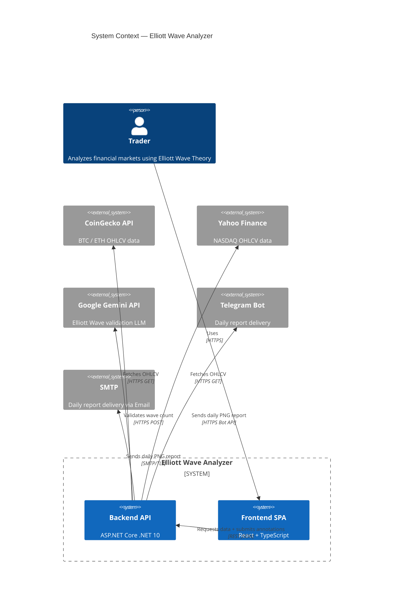

| Neighbour System | Relationship | Direction | Protocol |
|-----------------|-------------|-----------|----------|
| **CoinGecko API** | Provides OHLCV data for BTC and ETH | Backend → CoinGecko (pull) | HTTPS GET |
| **Yahoo Finance** | Provides OHLCV data for NASDAQ (planned) | Backend → Yahoo (pull) | HTTPS GET |
| **Google Gemini API** | Validates Elliott Wave counts against the canonical rules | Backend → Gemini (push) | HTTPS POST |
| **Telegram Bot API** | Delivers daily analysis reports as PNG chart images | Backend → Telegram | HTTPS Bot API |
| **SMTP Server** | Delivers daily analysis reports via email | Backend → SMTP | SMTP/TLS |

## Technical Context {#_technical_context}

| Channel | Protocol | Format | Endpoint |
|---------|----------|--------|----------|
| Frontend ↔ Backend | HTTPS | JSON (REST) | `/api/*` |
| Backend → CoinGecko | HTTPS (GET) | JSON (array of arrays) | `api.coingecko.com/api/v3/coins/{id}/ohlc` |
| Backend → LLM provider | HTTPS (POST) | JSON (`Microsoft.Extensions.AI` `IChatClient`) | Claude / Gemini / OpenAI — selected via `LlmProvider:Active` |
| Backend → Telegram | HTTPS | Multipart (PNG) | `api.telegram.org/bot{token}/sendPhoto` |

---

# Solution Strategy {#section-solution-strategy}

| Problem | Decision | Rationale | Quality Goal |
|---------|----------|-----------|--------------|
| Multiple data sources (CoinGecko, Yahoo Finance) | `IMarketDataProvider` interface + chain-of-responsibility selection | New provider = new class + one DI line; no existing code changes | Extensibility (OCP) |
| Indicator calculation | Delegate to Skender.Stock.Indicators behind `IIndicatorCalculator` | Avoids reimplementing Wilder's Smoothing and EMA seeding; Skender types never leak into domain | Correctness, Testability |
| Multiple LLM providers (Claude, Gemini, OpenAI) & model deprecations | Single `IChatClient` (`Microsoft.Extensions.AI`) selected via `appsettings.json → LlmProvider:Active`; model name is config | Switching provider or model is a config change, no deployment; one factory, no bespoke HTTP/JSON per provider | Extensibility (OCP), Maintainability |
| LLM integration in tests | `IChatClient` faked (`FakeChatClient`) at the boundary | Tests never call a real LLM; fast, deterministic, free | Testability |
| Prompt quality | Structured text with wave table + Elliott rules + JSON schema instruction | More precise than image analysis; gives Gemini exact prices and dates | Correctness |
| Frontend indicator rendering | Backend calculates, frontend only renders | TradingView Lightweight Charts is rendering-only; no ambiguity about calculation correctness | Correctness |
| API contract synchronization | OpenAPI codegen (`openapi-typescript`) generates TypeScript interfaces | No manual type maintenance; single source of truth in backend OpenAPI spec | Maintainability |

---

# Building Block View {#section-building-block-view}

## Whitebox Overall System — Level 1 {#_whitebox_overall_system}

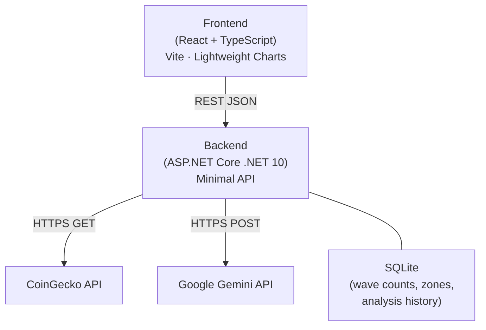

| Building Block | Responsibility |
|---------------|----------------|
| **Frontend** | Renders candlestick chart + MACD/RSI sub-panes; handles wave annotation interactions; submits annotations to backend |
| **Backend** | Data fetching, indicator calculation, Gemini orchestration, SQLite persistence, PNG chart generation for reports |
| **CoinGecko API** | OHLCV candle data for BTC and ETH (free tier) |
| **Google Gemini API** | Elliott Wave rule validation via LLM |
| **SQLite** | Persists wave counts, support/resistance zones, and daily analysis history |

## Level 2 — Backend Whitebox {#_white_box_backend}

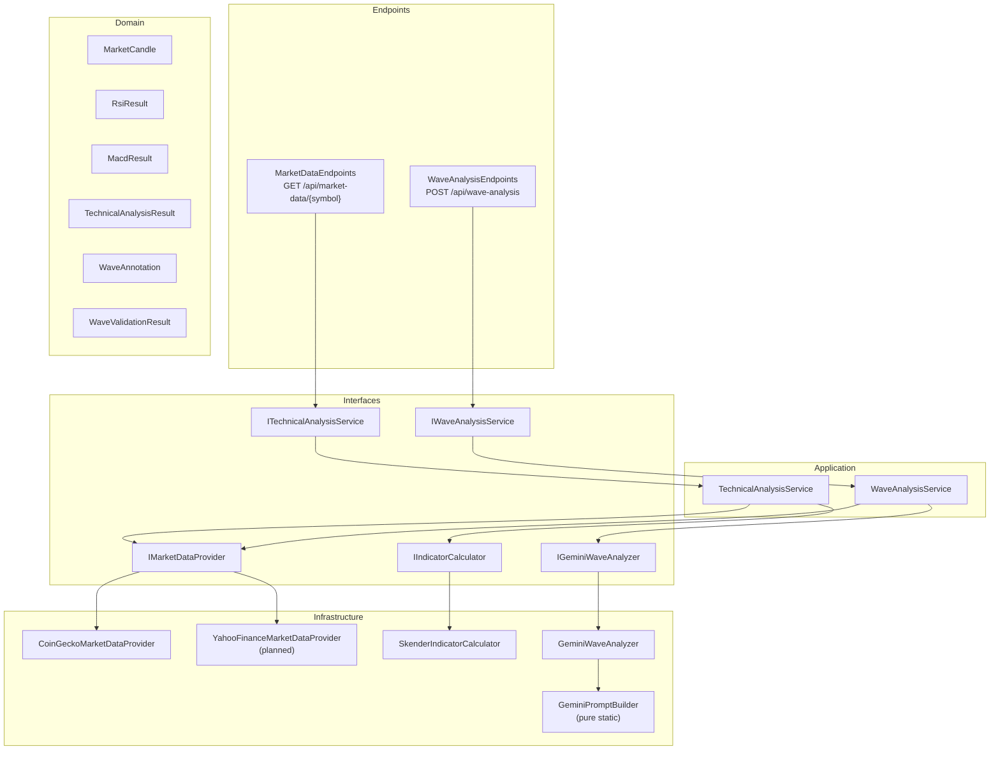

**Interfaces act as the seam between layers. No application-layer class imports an infrastructure type directly.**

| Component | Responsibility |
|-----------|----------------|
| `MarketDataEndpoints` | HTTP handler: parse request, call service, return JSON or Problem |
| `WaveAnalysisEndpoints` | HTTP handler: deserialize annotations, call service, return validation result |
| `TechnicalAnalysisService` | Select provider by symbol, fetch candles, delegate to calculator |
| `WaveAnalysisService` | Validate annotations, fetch candle context, delegate to Gemini analyzer |
| `CoinGeckoMarketDataProvider` | HTTP GET `/coins/{id}/ohlc`; map JSON arrays to `MarketCandle` |
| `SkenderIndicatorCalculator` | Bridge `MarketCandle` → Skender `IQuote` via private adapter; map results to domain types |
| `GeminiPromptBuilder` | Pure static: assemble structured text prompt from symbol, candles, annotations |
| `GeminiWaveAnalyzer` | Call Gemini via `Google.GenAI` SDK; parse JSON response; map to `WaveValidationResult` |

## Level 3 — Provider Chain (Open/Closed Principle) {#_provider_chain}

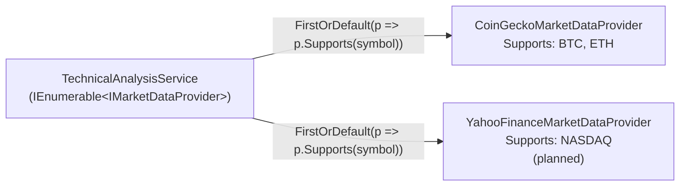

Adding a new data source (NASDAQ via Yahoo Finance) requires:
1. A new `YahooFinanceMarketDataProvider : IMarketDataProvider` class
2. One line in `Program.cs`: `builder.Services.AddTransient<IMarketDataProvider, YahooFinanceMarketDataProvider>()`

No existing code is modified (OCP).

---

# Runtime View {#section-runtime-view}

## Scenario 1 — Market Data Request {#_runtime_scenario_1}

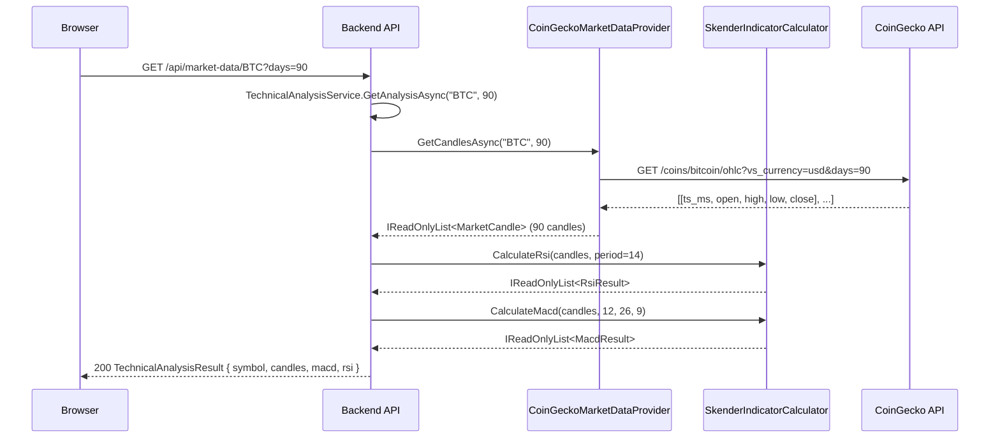

## Scenario 2 — Elliott Wave Validation {#_runtime_scenario_2}

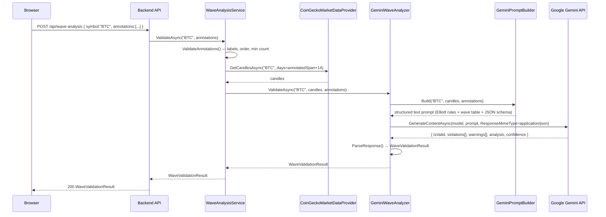

## Scenario 3 — Invalid Annotation (Early Return) {#_runtime_scenario_3}

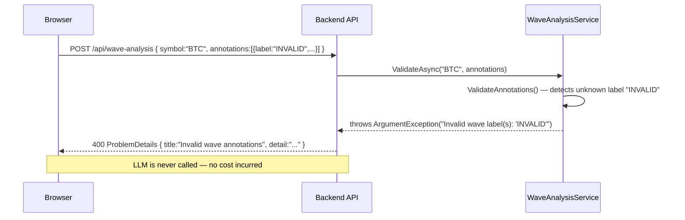

## Scenario 4 — Track Record: Save then Evaluate (REQ-004) {#_runtime_scenario_4}

Shows how the persistence-and-evaluation requirement was actually implemented: the deterministic
geometry of a count is stored, and its outcome is recomputed fresh on every read against the
candles that formed since the save — the outcome is never persisted, so it always reflects the
latest price. The pure `AnalysisOutcomeEvaluator` does the decision; the service only orchestrates.

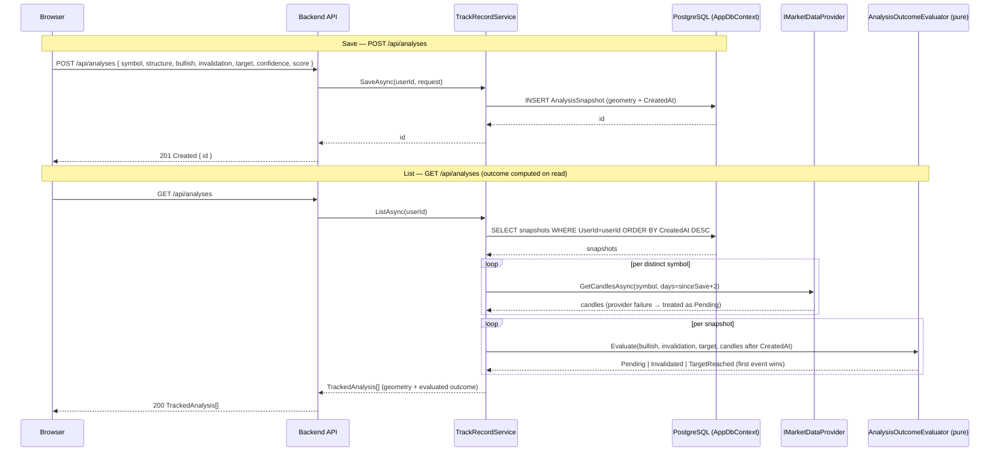

## Scenario 5 — Track Record UI: Save a Count, Review Outcomes (REQ-006) {#_runtime_scenario_5}

The frontend side of the track record. `AutoAnalysisPanel` raises a save with the ranked count;
`WaveWorkspace` maps it to the API payload (`toTrackAnalysisRequest`) and drives the mutation, then
invalidates the `['analyses']` query so `TrackRecordPanel` re-renders with the fresh list and its
outcome badges. No new backend — this consumes the Scenario-4 endpoints (hence no ADR).

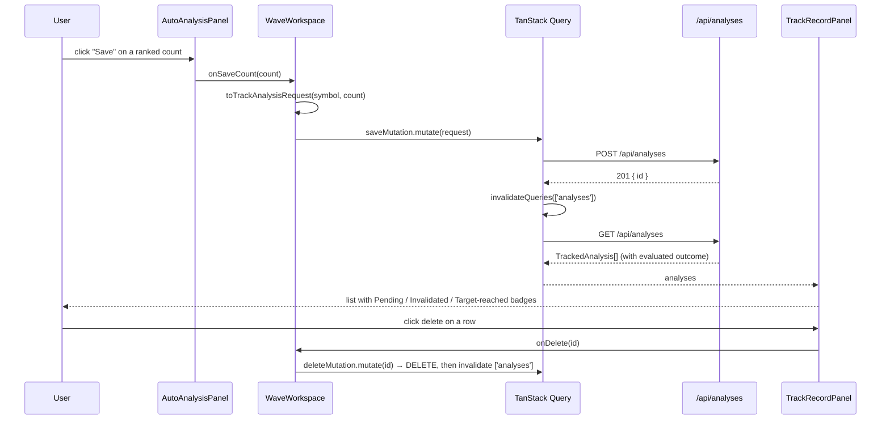

## Scenario 6 — Price Alert: Scheduled Re-evaluation → Notify (REQ-007) {#_runtime_scenario_6}

How a saved analysis turns into a notification. The scheduler ticks; the service re-evaluates
only still-pending snapshots and, on a transition to a terminal outcome, delivers once through
the enabled channels and advances the stored outcome so it never re-fires.

```mermaid
sequenceDiagram
    participant Cron as AlertBackgroundService (cron)
    participant AS as AlertService
    participant DB as PostgreSQL (AppDbContext)
    participant TA as ITechnicalAnalysisService
    participant Eval as AnalysisOutcomeEvaluator + AlertDecision (pure)
    participant Ch as IReportDeliveryChannel(s)

    Cron->>AS: RunAsync()
    AS->>DB: SELECT snapshots WHERE AlertedOutcome = Pending
    DB-->>AS: pending snapshots
    loop per distinct symbol
        AS->>TA: GetAnalysisAsync(symbol) → candles + chart
    end
    loop per snapshot
        AS->>Eval: Evaluate(candles after CreatedAt) → outcome; NewAlert(alerted, outcome)
        alt transition Pending → Invalidated / TargetReached
            AS->>Ch: SendAsync(chart + "invalidated/target" caption)
            AS->>DB: snapshot.AlertedOutcome = terminal outcome
        else still pending / already alerted
            Eval-->>AS: no alert
        end
    end
    AS->>DB: SaveChanges (advanced outcomes)
    AS-->>Cron: alerts delivered (count)
```

## Scenario 7 — Confidence Calibration (REQ-008) {#_runtime_scenario_7}

Whether the AI's confidence has held up. The endpoint reuses the track record's live-evaluated
outcomes and aggregates them with the pure calculator — a thin handler, no new state.

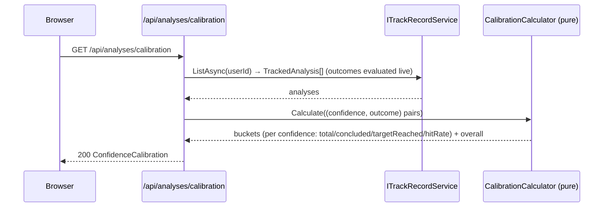

---

## Scenario 8 — Depot Import (REQ-016) {#_runtime_scenario_8}

A user uploads a broker statement; the router picks the importer that recognises it and returns
the parsed holdings. Each broker is one `IDepotImporter`; the router never changes (OCP).

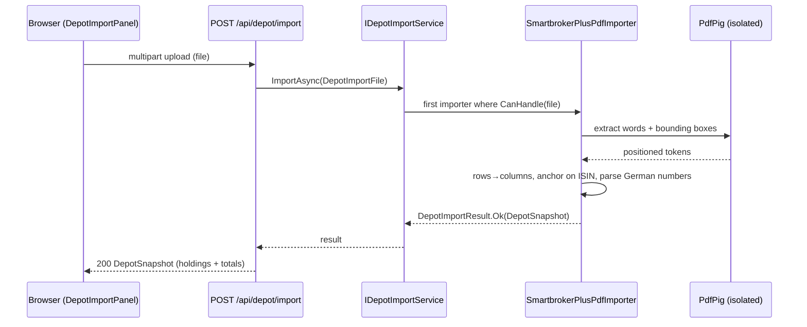

---

## Scenario 9 — Resolve a Symbol, Analyze on 4H (REQ-011, REQ-021) {#_runtime_scenario_9}

A user searches an instrument (ticker/name/ISIN), then charts it on 4H. Resolution is cached; 4H
is resampled from hourly candles; a request past the source's hourly window fails honestly.

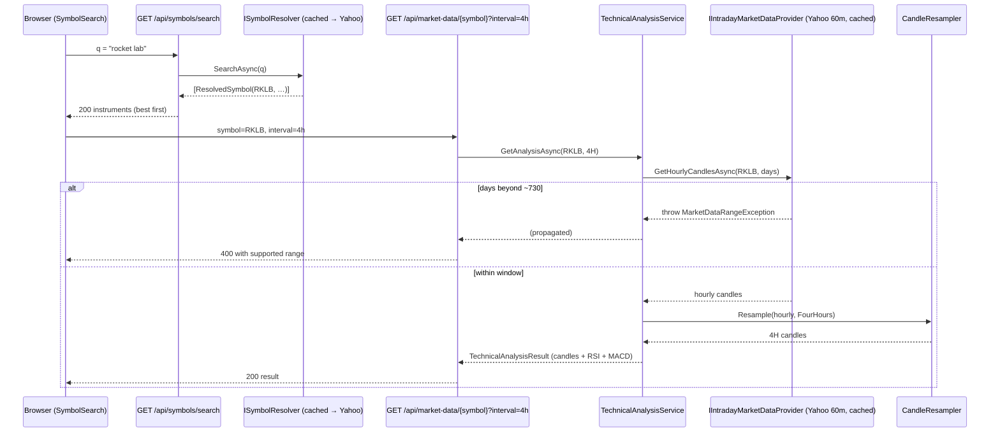

---

## Scenario 10 — Project a Count with Log-Correct Confluence Zones (REQ-022) {#_runtime_scenario_10}

After a deterministic count is chosen, `ProjectionService` derives forward levels. It auto-selects the price scale from the pivots, then asks the pure `FibConfluenceCalculator` to cluster the relevant legs' Fibonacci levels into scored zones. All geometry is deterministic; the LLM only narrates the resulting zones (ADR-009 invariant preserved).

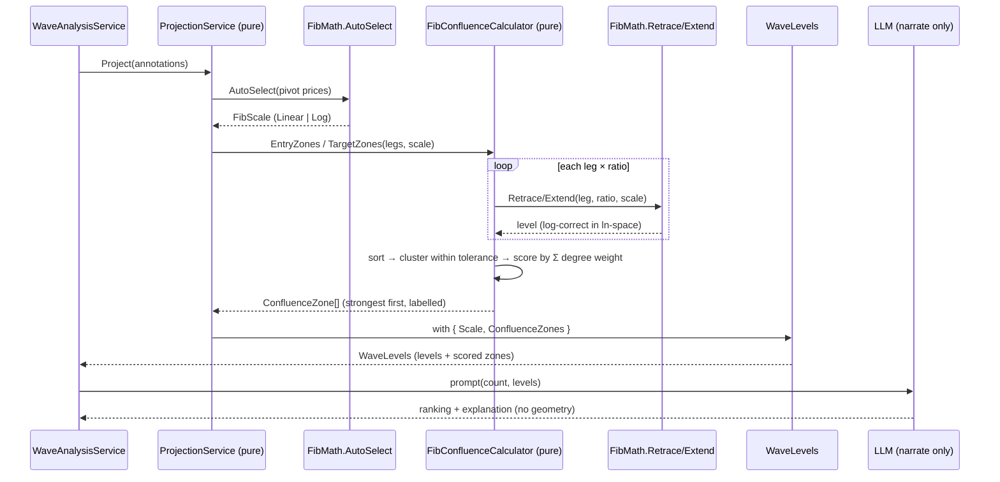

---

## Scenario 11 — Top-Down Multi-Timeframe Consistency (REQ-023) {#_runtime_scenario_11}

A user runs the auto analysis; alongside it, the deterministic top-down read parses weekly → daily → 4H, constraining each finer count to the wave unfolding above it and reporting a verdict per link. No LLM participates.

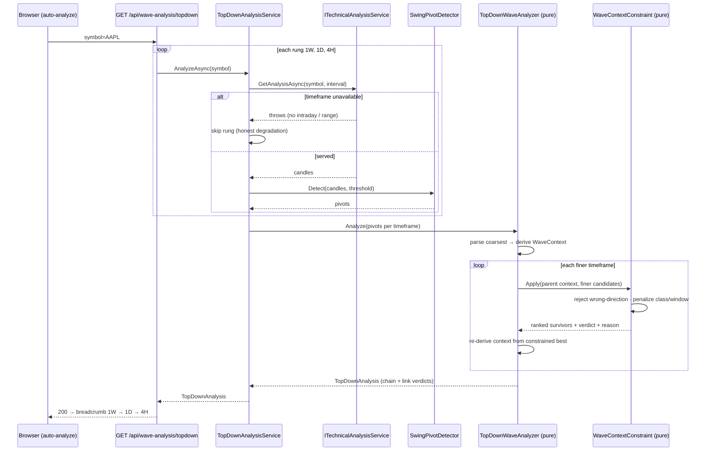

---

## Scenario 12 — Scenario Tree Auto-Switch on Invalidation (REQ-024) {#_runtime_scenario_12}

A saved analysis's primary invalidation breaks during the scheduled alert pass. The system delivers the invalidation alert, promotes the best alternate, records the switch, and re-opens the analysis under the new primary. All decisions are deterministic (no LLM).

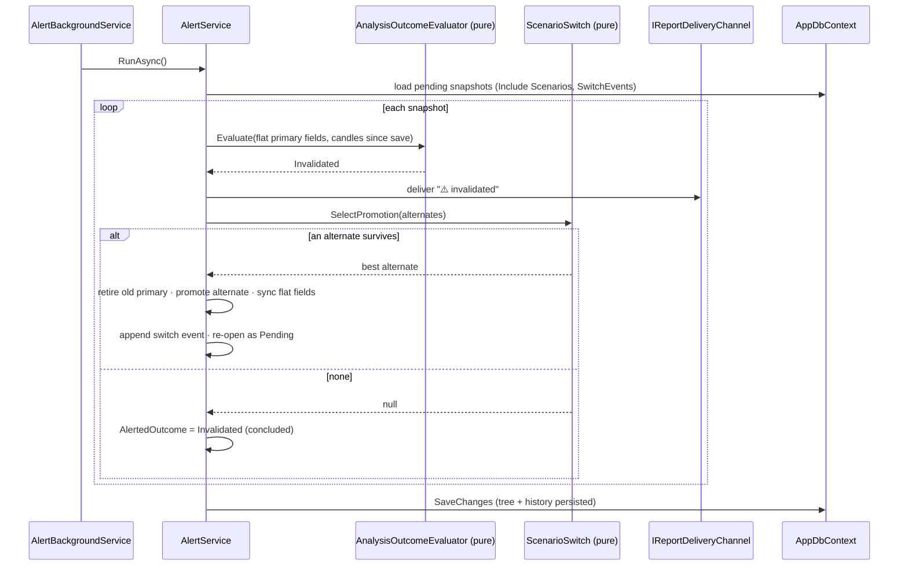

---

## Scenario 13 — Export a Saved Analysis as an Annotated Chart (REQ-025) {#_runtime_scenario_13}

A user downloads the publication-grade chart for one of their saved analyses. Ownership is enforced, candles are fetched live, the layout is decided by a pure composer (all geometry), and only the final rasterization touches SkiaSharp. Deterministic for a given analysis + render date.

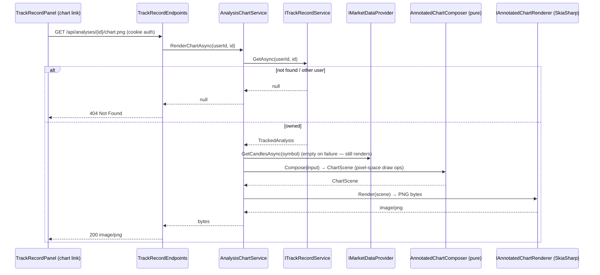

---

## Scenario 14 — Backtest a Symbol with No Lookahead (REQ-026) {#_runtime_scenario_14}

An operator runs a backtest. The harness slides a cutoff across history; at each step the analysis stage sees only a cutoff-bounded window (the guard type forbids reaching past it), and the following candles score the recorded scenario. Results are aggregated and persisted idempotently by dataset hash; the summary reads back for the track-record page and feeds priors into scenario probabilities.

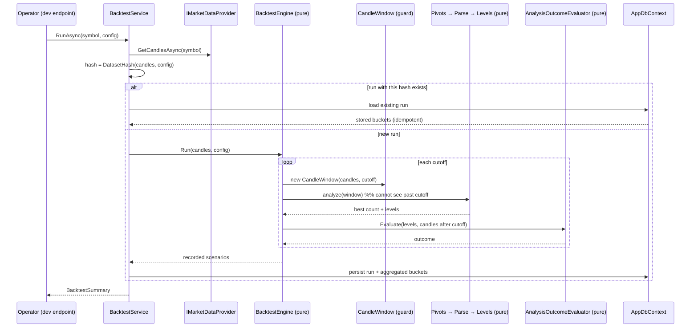

---

## Scenario 15 — Portfolio Review of an Imported Depot (REQ-027) {#_runtime_scenario_15}

A user with an imported depot opens the portfolio review. Each holding is resolved from its ISIN, analyzed top-down, and narrated from the deterministic facts (the narrative is fact-guarded and optional). Positions that can't be resolved or analyzed are surfaced with a reason; results are cached per (ISIN, day) so a re-open is cheap.

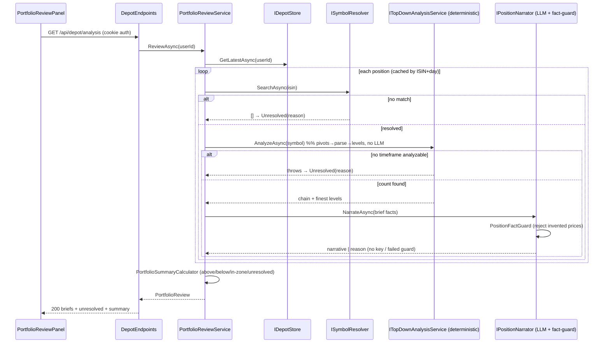

---

## Scenario 16 — Verify an Analyst's Chart from a Screenshot (REQ-028) {#_runtime_scenario_16}

A user uploads an analyst's annotated chart. A vision model extracts the claimed count (perception only); every claimed pivot must snap to a real candle extreme (the hallucination guard) before any rule touches it; the deterministic rules then verify what survives, side-by-side with our own count. Too few snapped pivots → the report says the image couldn't be reliably extracted rather than guessing. The image is parsed in-request and never stored.

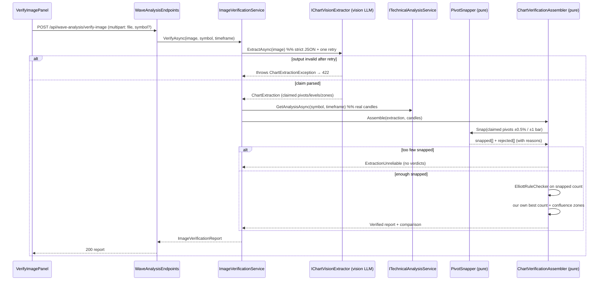

---

## Scenario 17 — Scan the Universe for Setups (REQ-029) {#_runtime_scenario_17}

A user sweeps a set of symbols for setups. The deterministic pipeline runs per symbol with bounded concurrency; each symbol's hit is cached per day; a symbol that can't be served is skipped, not fatal. Hits are ranked and returned with coverage. No LLM.

```mermaid
sequenceDiagram
    participant UI as ScannerPanel
    participant Ep as ScanEndpoints
    participant Svc as ScanService
    participant Md as ITechnicalAnalysisService
    participant Sc as SetupScanner (pure)

    UI->>Ep: GET /api/scan?symbols=&structure=&inZone=&timeframe=
    Ep->>Svc: ScanAsync(symbols|default, filter, timeframe, limit)
    loop each symbol (bounded concurrency, cached by symbol+day)
        Svc->>Md: GetAnalysisAsync(symbol, timeframe)
        alt not servable
            Md-->>Svc: throws → skip (scan continues)
        else candles
            Svc->>Sc: Scan(symbol, candles)  %% pivots→parse→best count→hit?
            Sc-->>Svc: ScanHit? (structure, wave, score, zone flags, distance)
        end
    end
    Svc->>Sc: Rank(hits passing filter)
    Sc-->>Svc: hits, most-relevant first
    Svc-->>Ep: ScanResult (hits, scanned, matched)
    Ep-->>UI: 200 ranked result
```

---

## Scenario 18 — Analyze with the Caller's Own LLM Key (REQ-013) {#_runtime_scenario_18}

An authenticated user who saved their own key for the active provider triggers an LLM-using endpoint. The active `IChatClient` resolves per request: it decrypts *their* key and builds a client with it; a user without a stored key (or a background job with no HTTP user) transparently falls back to the operator's startup key. The key is decrypted only to build the client and is never logged.

```mermaid
sequenceDiagram
    participant UI as Client
    participant Ep as Wave-Analysis Endpoint
    participant Cc as UserAwareChatClient (singleton IChatClient)
    participant Http as IHttpContextAccessor
    participant Vault as IUserKeyStore (scoped)
    participant Fac as IUserChatClientFactory
    participant Res as IChatClientResolver (startup key)

    UI->>Ep: POST /api/wave-analysis (auth)
    Ep->>Cc: GetResponseAsync(prompt)
    Cc->>Http: current user id (NameIdentifier claim)?
    alt authenticated user
        Cc->>Vault: GetDecryptedAsync(userId, activeProvider)  %% short-lived scope
        alt user has a key
            Vault-->>Cc: decrypted key (never logged)
            Cc->>Fac: Create(activeProvider, key)
            Fac-->>Cc: user's IChatClient
        else no stored key
            Cc->>Res: Resolve(activeProvider)
            Res-->>Cc: operator's startup client
        end
    else no HTTP user (background job)
        Cc->>Res: Resolve(activeProvider)  %% vault not queried
        Res-->>Cc: operator's startup client
    end
    Cc-->>Ep: ChatResponse
    Ep-->>UI: 200 analysis
```

---

## Scenario 19 — Size a Trade from the Count's Geometry (REQ-030) {#_runtime_scenario_19}

A user turns a count into risk terms. The frontend sends the geometry it already has (invalidation as the stop, target zones mapped to their first-touch edge, direction) plus the entry and account-risk; the pure calculator returns stop distance, R:R per target and the position size. An entry on the wrong side of the invalidation comes back as an explicit no-valid-stop result — never a crash or a negative size. No LLM.

```mermaid
sequenceDiagram
    participant UI as RiskBox
    participant Ep as RiskEndpoints
    participant Calc as RiskCalculator (pure)

    UI->>Ep: POST /api/risk (entry, invalidation, targets, bullish, account-risk)
    Ep->>Ep: RiskRequest.ResolveRiskCapital()  %% percent-of-equity or absolute
    Ep->>Calc: Assess(entry, invalidation, targets, bullish, riskCapital)
    alt entry on the wrong side of the stop
        Calc-->>Ep: hasValidStop:false + reason (no size)
    else valid stop
        Calc->>Calc: stop distance, R:R per target, size = riskCapital / stopDistance
        Calc-->>Ep: RiskAssessment (stop, R:R[], size, notional)
    end
    Ep-->>UI: 200 assessment  %% "arithmetic, not advice"
```

---

## Scenario 20 — Edit a Count and Re-verify Deterministically (REQ-031) {#_runtime_scenario_20}

The analyst places, nudges, relabels or deletes a pivot. Each edit snaps to a real candle client-side, then a debounced call re-runs the deterministic pipeline server-side (which snaps again authoritatively) and returns the objective read — rules, projections, score — with no LLM. The verdict updates live; the LLM is only invoked later, on demand, to narrate the analyst's own count.

```mermaid
sequenceDiagram
    participant User as Analyst
    participant WS as WaveWorkspace
    participant Ep as /wave-analysis/verify
    participant Svc as WaveVerificationService
    participant V as WaveVerifier (pure)

    User->>WS: add / nudge / relabel / delete a pivot
    WS->>WS: snapToCandle / nudgePivot  %% lands on a real extreme
    WS->>WS: debounce (≈400ms)
    WS->>Ep: POST edited annotations (no LLM)
    Ep->>Svc: VerifyAsync(symbol, annotations)
    Svc->>Svc: fetch candles
    Svc->>V: Verify(annotations, candles)
    V->>V: PivotSnapper → ElliottRuleChecker → ProjectionService → WaveGuidelineScorer
    V-->>Svc: WaveVerification (snapped, rules, levels, score)
    Svc-->>Ep: verification
    Ep-->>WS: 200 live verdict (valid?, failing rules, levels, score)
    Note over WS,User: LLM narration is a separate, optional step — never in this loop
```

---

## Scenario 21 — Retrieve Historical Analogs of the Current Count (REQ-034) {#_runtime_scenario_21}

```mermaid
sequenceDiagram
    actor User
    participant WS as Historical analogs panel
    participant Ep as GET /api/wave-analysis/analogs
    participant Svc as HistoricalAnalogService
    participant Data as IMarketDataProvider
    participant Eng as SetupHistoryBuilder + Retriever + Aggregator (pure)
    participant N as IAnalogNarrator (fact-guarded)

    User->>WS: Find historical analogs
    WS->>Ep: symbol, interval (1d/1w)
    Ep->>Svc: AnalyzeAsync
    alt cached report for (symbol, tf, day)
        Svc-->>Ep: (cached deterministic report)
    else build
        Svc->>Data: GetCandlesAsync(symbol)
        Svc->>Eng: sweep corpus (CandleWindow per cutoff — no lookahead) + fingerprint current count
        Eng-->>Svc: nearest concluded analogs + measured stats (hit-rate, median days)
    end
    Svc->>N: NarrateAsync(report)
    Note over N: cites only computed facts; AnalogFactGuard rejects any invented rate/count/date;<br/>no key or too few analogs ⇒ explicit reason, deterministic read still stands
    N-->>Svc: report + optional narrative
    Svc-->>Ep: report
    Ep-->>WS: 200 analogs + stats + summary
```

---

## Scenario 22 — Propose Alternate Hypotheses, Engine Validates (REQ-035) {#_runtime_scenario_22}

```mermaid
sequenceDiagram
    actor User
    participant WS as Alternate hypotheses panel
    participant Ep as GET /api/wave-analysis/hypotheses
    participant Svc as AlternateHypothesisService
    participant LLM as IHypothesisProposer
    participant V as StructureVocabulary + HypothesisValidator (pure)

    User->>WS: Propose & test hypotheses
    WS->>Ep: symbol, interval
    Ep->>Svc: AnalyzeAsync
    alt no LLM key
        Svc-->>Ep: report { unavailable } — deterministic search unaffected
    else
        Svc->>LLM: propose structures for the detected pivots (bounded)
        LLM-->>Svc: [ {structure, reason}, … ]  (names only, never a verdict)
        loop each proposal (capped)
            Svc->>V: in-vocabulary? then generate + rule-check over pivots
            Note over V: out-of-vocab ⇒ dropped before generation;<br/>hard-rule fail ⇒ rejected WITH the rule, never valid;<br/>survivor ⇒ scored by the shared guideline scorer
            V-->>Svc: HypothesisResult (valid+score | rejected+failing rule)
        end
    end
    Svc-->>Ep: validated[] + rejected[]
    Ep-->>WS: 200 — the LLM proposed, the engine decided
```

---

# Deployment View {#section-deployment-view}

## Infrastructure Overview {#_infrastructure_overview}

```mermaid
graph TD
    subgraph "Developer Machine / Home Server"
        BE["Backend\nbinaries/ElliotWaveAnalyzer.Api\n(.NET 10 self-contained)"]
        FE["Frontend\ndist/index.html + assets\n(served as static files by backend)"]
        DB["SQLite\nelliot.db"]
        BE --- DB
        BE --- FE
    end

    subgraph "External Services"
        CG["CoinGecko API\napi.coingecko.com"]
        GEM["Google Gemini API\ngenerativelanguage.googleapis.com"]
        TG["Telegram Bot API"]
    end

    Browser["Browser"] -- "HTTPS" --> BE
    BE -- "HTTPS" --> CG
    BE -- "HTTPS" --> GEM
    BE -- "HTTPS" --> TG
```

**Target deployment model:** Self-contained single-file .NET binary (`dotnet publish -r linux-x64 --self-contained`). The frontend `dist/` is copied into the binary's static files directory. One process, one port, no runtime dependencies.

**Future:** Docker container as Home Assistant Add-on.

## Build Pipeline {#_build_pipeline}

```mermaid
flowchart LR
    Push["git push"] --> CI

    subgraph CI["GitHub Actions"]
        direction TB
        build_be["backend: dotnet build"]
        test_be["backend: dotnet test"]
        build_fe["frontend: tsc + vite build"]
        test_fe["frontend: vitest"]
        security["security: dotnet vuln scan\n+ npm audit"]
        codeql["CodeQL: C# + TypeScript"]

        build_be --> test_be
        build_fe --> test_fe
    end

    CI --> PR_Check["PR: all checks green\nbefore merge"]
    Tag["git tag v*"] --> Release["release.yml:\nself-contained binary\nGitHub Release"]
```

| Workflow | Trigger | Checks |
|---------|---------|--------|
| `ci.yml` | Push / PR on main | Backend: restore → build → test (NUnit); Frontend: tsc → vitest → vite build |
| `security.yml` | Push / PR / weekly Friday | `dotnet list package --vulnerable`; `npm audit --audit-level=high` |
| `codeql.yml` | Push / PR / weekly Sunday | CodeQL static analysis: C# + JavaScript/TypeScript |
| `release.yml` | Tag `v*` | Self-contained backend binary + frontend build → GitHub Release artifact |

---

# Cross-cutting Concepts {#section-concepts}

## Dependency Injection {#_concept_di}

ASP.NET Core's built-in DI container is used. `Program.cs` is the composition root. All services depend on interfaces only — never on concrete types.

```
Program.cs (composition root)
  ├─ IMarketDataProvider → CoinGeckoMarketDataProvider (Transient)
  ├─ IMarketDataProvider → YahooFinanceMarketDataProvider (Transient, future)
  ├─ IIndicatorCalculator → SkenderIndicatorCalculator (Transient)
  ├─ ITechnicalAnalysisService → TechnicalAnalysisService (Transient)
  ├─ IGeminiWaveAnalyzer → GeminiWaveAnalyzer (Transient)
  └─ IWaveAnalysisService → WaveAnalysisService (Transient)
```

`TechnicalAnalysisService` receives `IEnumerable<IMarketDataProvider>` — all registered providers are injected, and the first that supports the requested symbol is selected.

## Skender Isolation {#_concept_skender}

`Skender.Stock.Indicators` is referenced exclusively in `SkenderIndicatorCalculator.cs`. The Skender `IQuote` interface is bridged via a private nested `SkenderQuoteAdapter` — not visible outside that file. Domain types (`MarketCandle`, `RsiResult`, `MacdResult`) never implement or import Skender interfaces.

This means:
- Skender can be upgraded or replaced without touching any other file.
- Unit tests mock `IIndicatorCalculator` and never depend on Skender behavior.
- Integration tests (in `SkenderIndicatorCalculatorTests`) test mathematical properties, not Skender internals.

## Gemini Isolation {#_concept_gemini}

`Google.GenAI` is referenced exclusively in `GeminiWaveAnalyzer.cs`. All other code depends only on `IGeminiWaveAnalyzer`.

`GeminiPromptBuilder` is a pure static class (no dependencies, no I/O) — fully testable without mocks. `GeminiWaveAnalyzer` deserializes Gemini's JSON response into a private `GeminiResponseDto` and maps it to the domain `WaveValidationResult` before returning.

## Error Handling {#_concept_errors}

| Layer | Strategy |
|-------|----------|
| Invalid annotations | `WaveAnalysisService.ValidateAnnotations()` throws `ArgumentException` before any I/O — no Gemini cost incurred |
| CoinGecko HTTP error | `HttpRequestException` propagates; endpoint returns 502 ProblemDetails |
| Gemini empty/malformed response | `InvalidOperationException` thrown by `GeminiWaveAnalyzer`; endpoint returns 502 ProblemDetails |
| Unsupported symbol | `ArgumentException` from service; endpoint returns 400 ProblemDetails |

## Structured Logging {#_concept_logging}

Serilog (`Serilog.AspNetCore`) is wired via `builder.Host.UseSerilog()`. Configuration is read from `appsettings.json → Serilog` section. Sinks: Console (structured output template). Future: File or Seq sink via config only — no code change required.

## Testing Strategy {#_concept_testing}

| Level | Framework | What is tested |
|-------|-----------|----------------|
| **Indicator unit tests** | NUnit + (no mock needed) | Mathematical properties of RSI/MACD (range, trend direction, histogram invariant, date alignment) |
| **Service unit tests** | NUnit + NSubstitute | Orchestration logic: provider selection, delegation, result pass-through, input validation |
| **Prompt builder unit tests** | NUnit (pure) | Prompt content: symbol present, labels listed, prices listed, Elliott rules referenced, JSON schema requested |
| **Frontend component tests** | Vitest + React Testing Library | PriceChart renders without crashing; accepts candles prop |

All tests follow the `Subject_StateUnderTest_ExpectedBehaviour` naming convention.

## API Contract Synchronization {#_concept_api_contract}

OpenAPI spec is served by the backend at `/swagger/v1/swagger.json`. TypeScript interfaces for the frontend are generated via:

```bash
cd frontend && npm run generate:api
# Reads: http://localhost:5001/swagger/v1/swagger.json
# Writes: src/api/generated.ts
```

No manual type maintenance is needed; the backend OpenAPI spec is the single source of truth.

---

# Architecture Decisions {#section-design-decisions}

## ADR-001: SOLID Interfaces for All Cross-Layer Boundaries

**Context:** A single-developer project risks collapsing into a "big ball of mud" without disciplined structure.

**Decision:** Every cross-layer dependency goes through an interface. Infrastructure classes (`CoinGeckoMarketDataProvider`, `SkenderIndicatorCalculator`, `GeminiWaveAnalyzer`) implement interfaces defined in the `Interfaces/` layer. Application services depend only on those interfaces.

**Consequences:**

| | |
|---|---|
| (+) | Every infrastructure dependency is mockable in tests without network access |
| (+) | New providers/calculators/analyzers can be added without modifying existing classes (OCP) |
| (-) | More files than a simple, linear implementation |

---

## ADR-002: Skender.Stock.Indicators instead of Custom RSI/MACD

**Context:** RSI uses Wilder's Smoothing (exponential, non-simple), not a plain moving average. The warm-up period, the seeding convention, and the smoothing alpha all differ from textbook descriptions. MACD EMA seeding is similarly subtle.

**Decision:** Use `Skender.Stock.Indicators` (NuGet) for all indicator calculations. Do not implement RSI or MACD manually.

**Consequences:**

| | |
|---|---|
| (+) | Correct Wilder's Smoothing; tested against known reference data by the library maintainers |
| (+) | `SkenderIndicatorCalculator` is the only file that references Skender — easy to replace |
| (-) | External dependency; must monitor for breaking changes on major version bumps |

---

## ADR-003: Text-based Gemini Prompt instead of Chart Image Upload

**Context:** A chart image could be uploaded to Gemini's multimodal API for visual wave analysis.

**Decision:** Send wave annotations and candle context as structured text (markdown table with prices, dates, Δ% between waves) instead of an image.

**Consequences:**

| | |
|---|---|
| (+) | Exact numeric data — Gemini can compute wave ratios precisely |
| (+) | Lower cost (no image tokens) and faster response |
| (+) | `GeminiPromptBuilder` is pure and fully unit-testable |
| (-) | No visual chart context — Gemini cannot detect local trend structures not captured in the annotations |

---

## ADR-004: ResponseMimeType = "application/json" for Gemini

**Context:** By default Gemini may return markdown-fenced JSON or prose mixed with JSON, making parsing fragile.

**Decision:** Set `GenerateContentConfig.ResponseMimeType = "application/json"` on every Gemini request.

**Consequences:**

| | |
|---|---|
| (+) | Gemini is guaranteed to return raw JSON; no markdown fence stripping required |
| (+) | `System.Text.Json.JsonSerializer.Deserialize<T>()` works directly on the response |
| (-) | If the model does not support `ResponseMimeType`, the request fails rather than returning partial output |

---

## ADR-005: Multiple IMarketDataProvider Registrations with Chain-of-Responsibility Selection

**Context:** BTC/ETH come from CoinGecko; NASDAQ will come from Yahoo Finance. A factory pattern or conditional branching inside the service would require code changes for every new source.

**Decision:** Register all `IMarketDataProvider` implementations in DI. `TechnicalAnalysisService` receives `IEnumerable<IMarketDataProvider>` and selects the first provider whose `Supports(symbol)` returns true.

**Consequences:**

| | |
|---|---|
| (+) | Adding Yahoo Finance = one new class + one DI registration; zero changes to `TechnicalAnalysisService` |
| (+) | Provider selection logic is trivially testable via `Supports()` |
| (-) | Symbol routing is implicit (first-match); symbol ambiguity between providers must be avoided by convention |

---

## ADR-006: GeminiOptions with Configurable Model Name

**Context:** Google releases and deprecates Gemini model identifiers frequently (e.g. `gemini-1.5-flash` → `gemini-2.0-flash` → `gemini-2.5-flash`).

**Decision:** Model name is bound from `appsettings.json → Gemini:Model` via `IOptions<GeminiOptions>`. Default is `gemini-2.5-flash`.

**Consequences:**

| | |
|---|---|
| (+) | Model update requires only an appsettings change, no code deployment |
| (+) | Different environments (dev/prod) can use different models via environment-specific overrides |
| (-) | Operator must remember to update the model name when Google deprecates the current version |

---

## ADR-007: Architecture Governance — Mandatory ADRs, Requirements Register, Sequence Diagrams, 90% Coverage

**Context:** The architecture documentation repeatedly fell behind the code — ADRs stopped at ADR-006 while the system gained an LLM abstraction, a grammar parser and persistence, none of which were documented. "Update the docs later" does not happen.

**Decision:** Documentation is part of the change, enforced per PR. Every architecture decision or technology change requires an ADR in this section (same PR). Every feature is entered in the **Requirements Register** (§1) with a `REQ-NNN` id and, once fulfilled, gains a **Mermaid sequence diagram** in the Runtime View (§6) showing how it was implemented. The line-coverage target is raised to **≥90%**. These are Quality Gates, weighted the same as the tests, and are written into the `elliottwave-agents` skill and the PR template. (This ADR is self-demonstrating: it records the decision that mandates ADRs.)

**Consequences:**

| | |
|---|---|
| (+) | Docs, decisions and requirements stay current by construction — reviewed together with the code |
| (+) | Every requirement is traceable: issue → REQ id → ADR → sequence diagram → tests |
| (-) | Slightly more work per architecturally-relevant PR; deliberate, to stop doc rot |
| (+) | The 90% coverage gate is now **blocking** — CI fails below 90% line coverage (measured baseline ~94%); see ADR-015 for the exclusion policy that makes the percentage meaningful |

---

## ADR-008: Provider-Agnostic LLM Access via `Microsoft.Extensions.AI` (supersedes the Gemini-only integration)

**Context:** The original design bound directly to the Google Gemini SDK (`GeminiWaveAnalyzer`). Supporting Claude and OpenAI — and an ensemble across all three — would have meant three bespoke HTTP clients and branching throughout.

**Decision:** All LLM access goes through `Microsoft.Extensions.AI`'s `IChatClient` abstraction. Concrete clients (OpenAI, Gemini via its OpenAI-compatible endpoint, Claude via `Anthropic.SDK`) are registered as keyed singletons and chosen at startup from `LlmProvider:Active`; an `EnsembleAutoWaveAnalyzer` fans out to every configured provider and aggregates a consensus ranking. Token usage comes from the standardized `ChatResponse.Usage`.

**Consequences:**

| | |
|---|---|
| (+) | New provider = configuration + a keyed registration; domain code is untouched (OCP) |
| (+) | Ensemble/multi-model consensus becomes possible; individual provider failures are tolerated |
| (+) | Native JSON mode (`ChatResponseFormat.Json`) is requested uniformly, with robust extraction as fallback |
| (-) | Abstraction hides provider-specific features (e.g. uneven structured-schema support — see the deferral in ADR-009's PR); model ids must still be configured per provider |

**Supersedes:** the direct-SDK portion of ADR-003 and ADR-004 (the text-prompt and JSON-mode decisions still hold, now expressed through `IChatClient`).

---

## ADR-009: Deterministic Elliott Wave Grammar Parser (the LLM never does geometry)

**Context:** Picking turning points and counting waves from a numeric series is geometry, at which LLMs are unreliable; but the rulebook is inherently ambiguous (several valid counts). A single flat impulse enumerator could not express corrections, diagonals, or nesting.

**Decision:** Model the Elliott rulebook as a **grammar** (Motive → Impulse\|Diagonal; Corrective → Zigzag\|Flat\|Triangle; each wave a terminal leg or a nested structure) and parse the alternating pivot sequence with memoized dynamic programming over pivot intervals plus beam search. Pure, static rule checkers **prune** on hard-rule violations; tunable guideline scoring (Fibonacci fit, alternation, channel, time — `WaveScoringOptions`) **ranks** survivors. The LLM only ranks and explains the rule-valid candidates it is handed; it never invents or alters prices.

**Consequences:**

| | |
|---|---|
| (+) | Nested, multi-degree counts with per-node rule reports and a deterministic score; reproducible and testable without mocks |
| (+) | The trust boundary is explicit: deterministic geometry, LLM judgement on top |
| (-) | Combinatorial search must be bounded (`MaxEvaluations`, beam width, pivot cap) with a `SearchTruncated` flag; the parser is the most complex pure component in the codebase |

---

## ADR-010: Track-Record Persistence with Outcome Computed on Read

**Context:** Everything but auth was in-memory and lost on symbol change. A credible track record must show whether a saved count later held or failed — and that answer changes as new candles form.

**Decision:** Persist only the deterministic geometry of a saved count (`AnalysisSnapshot` on the existing PostgreSQL `AppDbContext`, EF migration). The **outcome is never stored** — it is recomputed on every read by the pure `AnalysisOutcomeEvaluator` against the candles that formed since the save (first event wins; invalidation breaks a same-candle tie). `TrackRecordService` lives in Infrastructure (it touches EF and market data) behind `ITrackRecordService`; the evaluator stays pure in the Application layer.

**Consequences:**

| | |
|---|---|
| (+) | The outcome always reflects the latest price; no stale/duplicated state to reconcile |
| (+) | The decision logic is pure and exhaustively unit-tested; a provider failure degrades one symbol to `Pending` rather than blanking the history |
| (-) | Listing re-fetches candles per distinct symbol (mitigated by the caching provider); a future scheduled re-evaluation will be needed to drive alerts |

---

## ADR-011: SOLID, TDD and Documented+Tested Endpoints as Enforced Quality Gates

**Context:** SOLID, TDD and API documentation were described in the skill but not enforced with the same weight as the tests, so drift was possible (god classes, concrete-type dependencies, or an endpoint shipping undocumented/untested).

**Decision:** Promote three rules to non-negotiable Quality Gates (skill + PR template), extending the governance of ADR-007:
1. **SOLID** — mandatory. The two watched-hardest violations: **no god classes** (SRP — one reason to change; business logic in small pure classes), and **depend on interfaces, not concrete types** across a boundary (DIP; third-party types stay in their implementation files). Enforced by `ArchitectureTests` where possible.
2. **TDD** — tests before implementation (Red → Green → Refactor), in the same PR.
3. **Every new API endpoint** is exercised by an acceptance/integration test **and** carries OpenAPI metadata (`WithSummary`/`WithDescription`/`Produces`/`ProducesProblem`) so it appears in the Scalar UI.

**Consequences:**

| | |
|---|---|
| (+) | Decoupling and testability stay high by construction; no endpoint ships undocumented or unexercised |
| (+) | Reviewers have concrete, checkable gates rather than vibes |
| (-) | Slightly more up-front discipline per PR; deliberate |

---

## ADR-012: Price Alerts — Scheduled Re-evaluation with Alert-on-Transition, Reusing the Delivery Channels

**Context:** The track record (ADR-010) computes each saved analysis's outcome on read, but a user should be told when a count invalidates or hits its target without re-opening the app. The daily-report feature already has scheduled delivery (Cronos) and pluggable channels (`IReportDeliveryChannel`: Telegram/Email).

**Decision:** A hosted `AlertBackgroundService` (opt-in via `Alerts:Enabled`) runs `IAlertService` on a cron schedule. `AlertService` (Infrastructure, orchestrator) loads still-pending snapshots, re-evaluates each with the pure `AnalysisOutcomeEvaluator`, and applies the pure `AlertDecision` (fire once, only on `Pending → Invalidated/TargetReached`). A new alert is rendered as a chart + caption and delivered through every enabled `IReportDeliveryChannel`. The snapshot stores the outcome it last alerted on (`AlertedOutcome`), advanced after firing so it never re-alerts. The decision logic stays pure and unit-tested; the wiring is covered by a PostgreSQL acceptance test.

**Consequences:**

| | |
|---|---|
| (+) | Reuses the existing scheduler + delivery channels (OCP/DIP); adding a channel still needs no change here |
| (+) | Exactly-once alerts; the "should we notify?" logic is a pure, exhaustively-tested function |
| (-) | Delivery is to the operator-configured global channels (same model as the daily report) — **per-user delivery targets are a follow-up** (REQ, not yet built); alerting cadence is bounded by the cron interval |

---

## ADR-013: Timeframe by Resampling Daily Candles (Daily/Weekly now; 4H needs an intraday source)

**Context:** Users want to analyse at different timeframes. The free data sources don't offer a clean multi-timeframe feed — Yahoo's chart API has no native `4h` interval and CoinGecko's free OHLC endpoint sets granularity implicitly from the day range.

**Decision:** Present timeframes by **resampling the daily candles we already fetch**, not by asking the provider for a timeframe. `ITechnicalAnalysisService.GetAnalysisAsync` takes a `CandleInterval`; it fetches daily and passes them through the pure `CandleResampler` (daily = pass-through; weekly = ISO-week OHLCV aggregation), computing RSI/MACD on the resampled series. The endpoint exposes `?interval=1d|1w`. A 4-hour timeframe cannot be **up**-sampled from daily — it needs an intraday-capable provider, so it is deliberately out of scope here and tracked as a follow-up.

**Consequences:**

| | |
|---|---|
| (+) | Weekly is exact, deterministic and unit-testable offline; no new data source or provider coupling |
| (+) | Providers stay daily-only and unchanged (OCP); the resampler is pure Application code |
| (-) | 4H (and finer) is not available until an intraday provider is added; weekly bars inherit any gaps in the daily source |

---

## ADR-014: Per-User API-Key Vault with ASP.NET Core Data Protection

**Context:** The Settings page claimed keys were "stored encrypted at rest, never shown again", but only kept `last4` in `localStorage` and sent the key nowhere — a real trust gap. Keys must be stored encrypted, server-side, and never returned.

**Decision:** A per-user `UserApiKey` table on the existing PostgreSQL context stores each key encrypted with **ASP.NET Core Data Protection** (a purpose-scoped `IDataProtector` — no bespoke crypto) plus its `last4` and a default flag. `IUserKeyStore` (Infrastructure) does encrypt/decrypt + default management; `/api/keys` exposes only the safe `SavedApiKey` view (provider + last4 + default) — the plaintext is accepted once over HTTPS and never returned. The frontend `useApiKeys` hook now reads/writes the vault instead of `localStorage`, so the Settings copy is finally accurate.

**Consequences:**

| | |
|---|---|
| (+) | The security promise is now true: encrypted at rest, never echoed back; per-user isolation; acceptance-tested (ciphertext ≠ plaintext, key never in any response) |
| (+) | No hand-rolled crypto — the framework owns key management and rotation |
| (+) | The stored key is now consumed by the LLM pipeline — the active-provider client is resolved per request against the user's key (ADR-031 / REQ-013) |
| (-) | The Data Protection key ring uses the default (local) provider; for multi-instance production it must be persisted to a shared store (DB/Redis) — a deployment follow-up |

---

## ADR-015: Coverage Exclusion Policy and a Blocking 90% Line-Coverage Gate

**Context:** ADR-007 raised the target to ≥90% line coverage but the CI step stayed advisory (`continue-on-error`) because the raw, unfiltered number counted startup wiring, EF-generated migrations and cron hosting loops as "untested logic" — which pulled the reported percentage down to a level that did not reflect the code we actually own. A gate is only meaningful if the denominator is honest.

**Decision:** Coverage is filtered to owned logic and the gate is made blocking:

- **Exclusions** (`backend/coverlet.runsettings`, applied in CI via `--settings`): the composition root (`Program`), DI registration (`Extensions.*`), EF migrations + model snapshot (`**/Migrations/*.cs`), compiler-generated / `[ExcludeFromCodeCoverage]` members, auto-properties (`SkipAutoProps`), and the `*BackgroundService` cron hosting loops (scheduling plumbing with no unit-testable branching beyond the cron-parse guard). Real I/O adapters that carry mapping logic (market-data providers, delivery channels) are **not** excluded — they are tested with a mocked `HttpMessageHandler`.
- **Blocking gate:** a dedicated CI step parses the Cobertura `line-rate` and fails the build below **90%**. It gates **line** coverage only (branch rate is reported but not gated). The `irongut/CodeCoverageSummary` step is kept purely for the PR comment/badge (advisory), because its `fail_below_threshold` also trips on the separate branch metric.

The CI-measured baseline after this ADR is ~94% line coverage.

**Consequences:**

| | |
|---|---|
| (+) | The 90% number is now both meaningful (owned logic only) and enforced (red build below it) — no more advisory drift |
| (+) | The exclusion list is explicit and reviewed in-repo, so what "counts" is auditable rather than hidden in tool defaults |
| (-) | Excluded files still need care: a bug in startup wiring or a background loop won't be caught by the coverage gate (mitigated by acceptance tests exercising the composed app) |
| (-) | Branch coverage (~81%) is reported but not gated; raising it is future work, not a release blocker |

---

## ADR-016: Average True Range via `IIndicatorCalculator`/Skender (no hand-rolled Wilder recurrence)

**Context:** `SwingPivotDetector` (Application) hand-rolled a Wilder-smoothed ATR (`WilderAtr`) to drive its volatility-adaptive swing threshold — the one indicator not delegated to Skender. RSI and MACD go through `SkenderIndicatorCalculator` precisely because Wilder smoothing and warm-up seeding are easy to get subtly wrong (ADR of Risk R3); ATR shares those subtleties. The stated reason for the exception — keeping the Application layer free of third-party contracts — is satisfiable without re-implementing the math.

**Decision:** `IIndicatorCalculator` gains `CalculateAtr(candles, period)` (Domain `AtrResult`), implemented in `SkenderIndicatorCalculator` via Skender's `GetAtr` (Skender types stay confined to that one file — DIP unchanged). `SwingPivotDetector.DetectAtrAdaptive` no longer computes ATR: it **receives** a precomputed `IReadOnlyList<decimal?>` series (one entry per candle, null in warm-up), so the detector stays pure geometry and the volatility math lives behind the interface. `WilderAtr` is deleted.

**Consequences:**

| | |
|---|---|
| (+) | One less reinvented wheel: ATR seeding/warm-up is Skender's well-tested code, consistent with RSI/MACD |
| (+) | `SwingPivotDetector` is still a pure static component (numbers in, pivots out) — the ATR dependency is passed in, not computed, so DIP holds without the Application layer touching Skender |
| (+) | The seam is exercised end-to-end in tests (real `SkenderIndicatorCalculator` output feeds the detector) |
| (-) | The volatility-adaptive strategy is a library capability exercised by tests; the default pipeline still uses the fixed-percent `Detect`. Wiring it in as a selectable mode is a separate, behaviour-changing follow-up |

---

## ADR-017: Depot Import via Pluggable `IDepotImporter` Files (PdfPig for Smartbroker+)

**Context:** Users want to load their broker depot (holdings) into the app to feed portfolio/wave analysis. Three brokers were requested: Smartbroker+, Scalable Capital, Trade Republic. **None offers an official public portfolio API** — Trade Republic only has unofficial reverse-engineered endpoints (phone+PIN+2FA, credential storage; ToS/fragility risk), Scalable Capital offers an official CSV export, Smartbroker+ a PDF export. Baking in unofficial APIs would mean storing broker credentials and tracking undocumented endpoints.

**Decision:** Import from **files**, not live APIs. `IDepotImporter` models one broker/format (`Source`, `CanHandle(file)`, `ImportAsync(file)`); `IDepotImportService` routes an upload to the first importer that accepts it. A new broker is a new importer + one DI line — the router and existing importers never change (OCP/DIP). The first importer, `SmartbrokerPlusPdfImporter`, parses the fixed-layout "Depotübersicht" PDF with **UglyToad.PdfPig** (MIT, pure managed): words are extracted with bounding boxes, grouped into rows, anchored on the ISIN, and read by column band (German number format, € / % suffixes). PdfPig is confined to that one Infrastructure file (same convention as Skender, Risk R3). `POST /api/depot/import` takes a multipart upload and returns the parsed `DepotSnapshot`; it is documented via OpenAPI and consumed by the Settings `DepotImportPanel`. Nothing is persisted yet.

**Consequences:**

| | |
|---|---|
| (+) | No broker credentials, no ToS/2FA risk, no undocumented endpoints — file import is robust and sanctioned |
| (+) | Scalable Capital (CSV) and Trade Republic (document export) slot in as further `IDepotImporter`s with no change to the router, endpoint or UI |
| (+) | PdfPig is isolated; a parser regression or library swap is a one-file change; tested against a **synthetic** fixture (no real PII committed) |
| (-) | The PDF parser is calibrated to the current Smartbroker+ column layout; a statement redesign needs re-calibration (mitigated by the anchored, band-based approach and unit tests) |
| (-) | Live/continuous sync is out of scope — import is a manual file upload; holdings are not yet persisted server-side (a follow-up) |

---

## ADR-018: Shared `CronBackgroundService` Base for Scheduled Jobs (Template Method)

**Context:** The alert scheduler and the daily-report scheduler were two hosted services with the *same* body — parse the cron expression (and stop if invalid), compute the next occurrence, `Task.Delay` until then, open a DI scope, run the work, swallow a failed run — differing only in the log name, the options-bound cron string and the one service they invoked. Duplicated scheduling logic means a fix (e.g. to cancellation handling) has to be made twice and can drift.

**Decision:** Extract an abstract `CronBackgroundService` (Infrastructure) that owns the scheduling loop once and exposes three abstract members — `SchedulerName`, `CronExpression`, `RunOnceAsync(scope, ct)` (Template Method). `AlertBackgroundService` and `DailyReportBackgroundService` become a handful of lines each: the schedule and which scoped service to run. DI registration (`AddHostedService<T>` behind the `Enabled` flags) is unchanged.

**Consequences:**

| | |
|---|---|
| (+) | One implementation of the cron loop: cancellation, invalid-cron handling and per-run scoping are fixed in one place (DRY) |
| (+) | A new scheduled job is a ~10-line subclass; harder to get the lifecycle subtly wrong |
| (+) | The shared guard/cancellation branches are unit-tested via a probe subclass (the loop body was previously untested, being coverage-excluded plumbing) |
| (-) | Behaviour is unchanged, so the win is maintainability, not features; the `*BackgroundService` names remain coverage-excluded (ADR-015) |

---

## ADR-019: Scalable Capital Depot Import from the Transactions CSV (aggregated to holdings)

**Context:** Scalable Capital has no public portfolio API but offers an official **transactions** CSV export (semicolon-delimited: `date;time;status;…;type;isin;shares;price;amount;…;currency`) — the sanctioned path (ADR-017). Unlike the Smartbroker+ PDF, which is a holdings snapshot, this is a *transaction ledger*: there is no single row that states "you own N shares worth X".

**Decision:** Add `ScalableCapitalCsvImporter : IDepotImporter` (Source = ScalableCapital), registered alongside the PDF importer — the router picks it via `CanHandle` (not-PDF + a Scalable header signature), no change to `IDepotImportService`, the endpoint or the UI (OCP). It **aggregates** transactions into current holdings: net quantity = Σ buy shares − Σ sell shares (savings-plan executions count as buys; dividends/deposits/fees don't change share count; cancelled rows skipped); cost is the **average** cost (Σ buy amount ÷ Σ buy shares). Market price/value and gain/loss are left null (a transaction carries its execution price, not the current market price); positions that net to ≤ 0 are dropped. Numbers are parsed tolerantly (German or invariant). The upload endpoint and Settings panel now accept CSV as well as PDF.

**Consequences:**

| | |
|---|---|
| (+) | The second broker is a self-contained importer + one DI line; the routing/endpoint/UI were untouched — the abstraction paid off |
| (+) | Uses the officially-supported export; no credentials, no unofficial API |
| (-) | Average-cost, not lot-level FIFO — the cost basis is an approximation after partial sells; acceptable for a portfolio overview, documented in code |
| (-) | No current market value / gain-loss from a transactions file (would need a live price lookup — a later enrichment step, shared with any importer) |

---

## ADR-020: One Top-Level Type Per File (enforced)

**Context:** Several files had grown to hold many types — `DepotTypes.cs` (6), `WaveCandidate.cs` (6), `WaveLevels.cs` (5), and others bundled an enum, its records and helpers together. Grouping types by file makes them hard to find (the file name no longer names the type) and lets unrelated types churn together in diffs.

**Decision:** Every top-level type (class/record/interface/enum/struct at namespace scope) lives in its own file named after it. Nested types stay with their parent (they are an implementation detail of it). This was applied across the API source (grouping files split, one file per type; no code, names, namespaces or doc-comments changed — pure moves) and is enforced by an architecture test, `OneTypePerFileTests`, which scans the API source and fails if any file declares more than one top-level type — a Quality Gate alongside the layering tests.

**Consequences:**

| | |
|---|---|
| (+) | The file name is the type name — navigation and review are predictable; diffs stay scoped to one type |
| (+) | The rule is enforced, not aspirational — a re-bundled file fails CI |
| (-) | More, smaller files (≈28 added); mitigated by the naming convention making them trivial to locate |

---

## ADR-021: Persist the Imported Depot Per User (upsert)

**Context:** Depot import (ADR-017/019) parsed a file and returned it, but stored nothing — the holdings vanished on refresh. Users expect their depot to still be there next time.

**Decision:** Persist the most recent import per user in PostgreSQL. A `SavedDepot` (header: source, timestamps, currency, totals) owns its `SavedDepotPosition` rows (cascade delete). `IDepotStore` (Infrastructure `DepotStore` over `AppDbContext`) **upserts** — a unique index on `UserId` enforces one depot per user, and `SaveAsync` deletes the previous one before inserting the new, so a re-import replaces rather than accumulates. The import endpoint saves the parsed snapshot after a successful parse; `GET /api/depot` returns the saved snapshot (204 when none). The Settings panel loads it on open. This mirrors the existing per-user stores (`AnalysisSnapshot`, `UserApiKey`) — same context, an EF migration, impl types internal.

**Consequences:**

| | |
|---|---|
| (+) | Imported holdings survive across sessions; the panel shows the current depot without re-uploading |
| (+) | Upsert keeps it simple — always exactly the latest depot, no history to prune, no stale duplicates |
| (-) | No import history is kept (only the latest); a time series of snapshots would be a larger, separate feature |
| (-) | Stored market values are as-of the import (no live revaluation) — the price-enrichment follow-up (ADR-019) would refresh them |

---

## ADR-022: Symbol Resolution and Intraday Candles via Yahoo Finance (arbitrary instruments, 1H/4H)

**Context:** Professional Elliott Wave analysis happens on 1H–4H charts of arbitrary instruments, but the app only served daily+ candles for a hardcoded five-symbol allow-list, and depot positions (ISINs) could not be analyzed at all. This is the prerequisite for every later phase of the professional-analysis mission (issue #116, unblocks #117–#123).

**Decision:**

- **Resolution:** `ISymbolResolver` turns a ticker, company name or **ISIN** into instruments. Implemented over Yahoo's search endpoint (`/v1/finance/search`), which already resolves ISINs to tickers — so no separate ISIN registry is needed for now (OpenFIGI remains a documented upgrade path if ISIN coverage proves insufficient). Results are cached 12h (`CachingSymbolResolver`, Decorator/OCP) since instrument metadata is static.
- **Intraday:** a new capability interface `IIntradayMarketDataProvider` (ISP — a daily-only source doesn't implement it) serves **hourly** candles; **4H** is resampled from hourly into UTC-aligned buckets by the existing `CandleResampler`. The Yahoo provider implements it (`interval=60m`), cached like the daily path. Yahoo's hourly history reaches ~730 days; a request past that raises `MarketDataRangeException` (surfaced as 400 with the supported range) rather than silently truncating — honest degradation.
- **Universe:** the Yahoo daily provider becomes the **catch-all** (registered last; earlier providers like CoinGecko claim their symbols first) and passes unmapped tickers straight through, so any resolved instrument charts. The symbol allow-list in `AnalysisRequestValidator` is replaced by an abuse guard only (`SymbolInput`: length cap + ticker character whitelist); existence is checked when data is fetched. `TechnicalAnalysisService` routes 1H/4H to the intraday provider, daily/weekly to the daily provider, and fails explicitly (no silent timeframe fallback) when no source can serve the requested timeframe.
- **API/UI:** `GET /api/symbols/search` (documented, consumed by the new `SymbolSearch` frontend component); the timeframe selector gains 1H/4H.

**Consequences:**

| | |
|---|---|
| (+) | Any resolvable stock/ETF/index/metal charts and auto-analyzes on 1H/4H/1D/1W; depot ISINs become analyzable (enables Phase 7) |
| (+) | One free source (Yahoo) covers search + daily + hourly; ISP keeps daily-only sources honest; abuse guard replaces the allow-list without opening an injection surface |
| (-) | **Crypto intraday** (BTC/ETH 1H/4H) needs CoinGecko intraday and is deferred — a documented follow-up; crypto still works on daily/weekly |
| (-) | Hourly depth is bounded by Yahoo's ~2-year window (a paid feed removes this); per-instrument intraday availability isn't probed up-front, so an unsupported 1H/4H request surfaces as the chart's error state rather than a pre-disabled button |

---

## ADR-023: Log-Scale Fibonacci Math and Scored Confluence Zones (the LLM still never does geometry)

**Context:** Fibonacci retracements/extensions were computed only in **linear** price space. On instruments that span multiples of their base price (a stock from €10 to €100, a metal over a multi-year cycle) linear ratios are visibly wrong — the "50% of the move" a professional draws on a log chart is not the arithmetic midpoint. Professionals also don't trade single ratios: they trade **confluence** — the "green box" where several ratios, ideally from different wave degrees, stack up. The app produced one support band and one target band per count, with no notion of overlap strength. Both gaps are pure geometry, so they belong on the deterministic side of the mission's core invariant (ADR-009): the LLM ranks and narrates, it never computes levels.

**Decision:**

- **`FibMath` (pure):** `Retrace`/`Extend` take an explicit `FibScale` (Linear|Log). Log math is done in ln-space — `exp(ln(to) − f·(ln(to) − ln(from)))` for retracements, `exp(ln(base) + m·(ln(to) − ln(from)))` for extensions — so equal *percentage* moves are equal distances. `AutoSelect` picks Log once a series spans more than ~3× its low, Linear otherwise; the chosen scale is **always reported**, never implicit.
- **`FibConfluenceCalculator` (pure):** turns one or more `FibLeg`s (each carrying a `DegreeWeight`) into scored `ConfluenceZone`s. Candidate levels are generated per leg/ratio, sorted, greedily clustered within a tolerance band, and each cluster scored by the **sum of its contributors' degree weights** — so more ratios, and higher degrees, make a stronger zone. Zones carry their `ContributingLevel`s (price + labelled basis, e.g. *"61.8% retracement of (1)→(2), log scale"*) and are returned strongest-first. Entry zones = clustered retracements (wave 2/4/B); target zones = clustered extensions (wave 3/5/C).
- **Integration:** `ProjectionService` auto-selects the scale from the count's pivots and attaches `Scale` + `ConfluenceZones` to `WaveLevels` (non-breaking `init` properties). Wave 5 draws confluence from two legs (Wave 1 and net Waves 1–3), so its target box is a genuine multi-degree cluster. The existing linear guideline bands are unchanged; the confluence zones are the log-correct, scored layer on top.
- **API/UI:** `WaveLevels` gains `scale` and `confluenceZones` in the OpenAPI contract and the mirrored frontend types; `LevelsSummary` badges the scale and renders each zone with its score (×weight) and contributing levels.

**Consequences:**

| | |
|---|---|
| (+) | Fib levels are correct on multi-multiple ranges (log), and the choice is visible rather than hidden; confluence turns "a band" into "a *ranked* band with a reason" |
| (+) | All new logic is pure/static and unit-tested against hand-computed values — the LLM gains richer deterministic inputs to narrate without ever doing the arithmetic |
| (-) | `AutoSelect`'s 3× threshold is a heuristic; a caller can still force a scale. The linear guideline bands and the log confluence zones coexist, so the UI shows two related-but-distinct level layers until a later phase consolidates them |

---

## ADR-024: Top-Down Multi-Timeframe Consistency by Constraining the Finer Parse (the LLM still never does geometry)

**Context:** The defining habit of professional Elliott Wave analysts is that a lower-timeframe count *lives inside* a higher-timeframe one — a 4-day wave [2] means the 2-hour chart should be counting a corrective structure downward. The parser already handles multi-scale pivots within one series, but nothing related the daily and weekly reads of the same instrument, so they could silently contradict each other. Deciding whether a finer count fits inside a coarser wave is pure geometry (direction, structure family, price window), so it belongs on the deterministic side of the core invariant (ADR-009): the LLM never chooses or rejects a count.

**Decision:**

- **`WaveContext` (derived, pure):** from a coarse count's deterministic forward levels (`ProjectionService` → `WaveLevels`) we derive what the finer timeframe must therefore be counting — the unfolding wave's **direction** (toward its support/target zone, so correct for bull and bear alike), its **class** (a pullback wave with a support zone ⇒ corrective; a thrust wave with a target zone ⇒ motive; a completing ABC ⇒ corrective), its **price window** (bounded by the wave's start, its destination and its invalidation line) and the **parent degree**.
- **Constraint (`WaveContextConstraint`, pure):** finer candidates that net the *wrong direction* are **hard-rejected** — they cannot be that wave's substructure. Survivors are re-scored with **soft** penalties for a class mismatch or a price range that spills outside the window (weights in `WaveScoringOptions`), then re-ranked. The per-link verdict is **Consistent** (direction + class + window all fit), **Tension** (direction fits, class or window doesn't) or **Contradiction** (nothing fits).
- **Orchestration (`TopDownWaveAnalyzer`, pure):** parses the coarsest timeframe freely, derives its context, constrains the next finer parse, records the link verdict, re-derives context from the constrained best, and repeats down the ladder. Degrees step Primary → Intermediate → Minor. No I/O and no LLM, so identical pivots serialize to an identical chain.
- **Service + API/UI:** `TopDownAnalysisService` fetches candles per rung of a fixed weekly→daily→4-hour ladder (reusing `ITechnicalAnalysisService`, so provider selection and resampling are not duplicated), detects pivots and calls the pure analyzer; a timeframe an instrument can't serve (e.g. no intraday source for 4H) is skipped honestly rather than failing the whole read. `GET /api/wave-analysis/topdown` exposes it (deterministic, so no token cost); the auto-analysis panel renders a compact `1W → 1D → 4H` breadcrumb with a verdict badge per link.

**Consequences:**

| | |
|---|---|
| (+) | The reads across timeframes can no longer silently contradict; a finer count is only surfaced if it can actually be the substructure of the wave above it, with the disagreement (Tension/Contradiction) named and explained |
| (+) | All of it is pure/static and unit-tested (context derivation, constraint, orchestration, determinism); the LLM gains a consistent multi-scale skeleton to narrate without ever selecting or rejecting a count |
| (-) | The ladder is fixed at three rungs (weekly/daily/4H); automatic timeframe selection and deeper chains are out of scope. The parser returns complete structures, so "the unfolding wave" is the one `ProjectionService` projects *next* from the coarse count, not a partially-drawn wave |

---

## ADR-025: Scenario Tree with Calibrated Probabilities, Zone-Entry Alerts and Invalidation Auto-Switch

**Context:** Professionals never publish one count — they publish a **primary plus alternates**, each with zones and a hard invalidation, and they *switch* when the invalidation breaks. Our saved analysis held a single flattened count; alerts fired on invalidation/target but nothing happened to the analysis afterwards, and `AlternativeScenario` was a two-string stub. We needed a persisted tree, honest probabilities, an entry-zone alert, and an auto-switch — all deterministic (no LLM decides which count wins).

**Decision:**

- **Model.** A saved analysis carries a scenario tree: a `Scenario` for the primary plus up to two alternates, each with direction, entry/target zone bounds, a hard invalidation, and a probability. Persisted as a child `AnalysisScenarioRow` collection (FK + cascade, mirroring `SavedDepot`→`SavedDepotPosition`) alongside an append-only `AnalysisSwitchEventRow` audit trail; the snapshot gains the primary's entry-zone bounds and an `EntryZoneAlerted` idempotency flag. Migration `AddScenarioTree`.
- **Probability from measured calibration.** Not stored — computed on read. `ScenarioProbability.From` maps a confidence `CalibrationBucket` (the user's own concluded analyses, by confidence) to a probability **only** when the bucket has ≥ 10 concluded analyses (`ProbabilityBasis.Calibrated`, probability = the bucket's hit-rate = target-reached ÷ concluded); below that it returns `InsufficientData` with no number. So the figure always reflects the latest outcomes and is never invented.
- **Zone-entry alert.** A new alert, decided by the pure `ZoneEntryDecision.ShouldAlert` (any candle's range overlaps the entry band, wick-aware), fired at most once per analysis via `EntryZoneAlerted` — the same fire-once idempotency model as the outcome alert.
- **Auto-switch.** When the alert pass sees the primary invalidated it delivers the invalidation alert and then runs `ScenarioSwitch.SelectPromotion` (highest-scored surviving alternate). If one exists it is promoted to primary, the old primary is **retired** (kept in the tree for history), a switch event is appended, the flat snapshot fields are synced to the promoted scenario, and the analysis re-opens as `Pending` so the new primary is tracked afresh. If no alternate remains, the analysis concludes `Invalidated` (existing semantics). All three decisions are pure and unit-tested; `AlertService` only orchestrates and persists.

**Consequences:**

| | |
|---|---|
| (+) | A saved call is now a living tree: it enters a zone with an alert, and on invalidation it self-promotes the best alternate and records why — the audit trail is never overwritten |
| (+) | Probabilities are honest (measured, or explicitly withheld) and the switch/zone/probability logic is pure and fully unit-tested; the full lifecycle is covered by a PostgreSQL acceptance test |
| (-) | Capped at two alternates and one entry zone per analysis (issue scope); position sizing/order suggestions are out of scope. The promoted primary re-evaluates from the original save time, not the switch instant — acceptable now, revisitable if double-fires appear |

---

## ADR-026: Channel Projections and a Draw-Op Seam for Publication-Grade Annotated Charts (SkiaSharp Confined to Infrastructure)

**Context:** Two gaps remained on the analytical and communication sides. Analytically, we scored channel *fit* but never *projected* channels — the 0→2 base channel and the 2→4 acceleration channel that professionals draw to bound wave 3 and target wave 5 are pure geometry, so they belong on the deterministic side of the core invariant (ADR-009). On the communication side, the app rendered a plain candles+RSI+MACD PNG (`SkiaSharpChartRenderer`) but nothing an analyst would publish: no wave labels, shaded Fibonacci boxes, invalidation lines with price tags, scenario arrows or channels. Naïvely extending the SkiaSharp renderer would bury all the layout/geometry decisions inside an Infrastructure class that can only be tested by decoding pixels (OCR-style) — brittle and slow, and it would spread the rendering backend across the layout logic.

**Decision:**

- **Channel projection (pure).** A static `ChannelProjector.Project(annotations, scale)` fits the base channel (0→2 line, parallel through 1) once wave 2 exists and the acceleration channel (2→4 line, parallel through 3) once wave 4 exists, projecting the wave-5 band one acceleration-leg (the 2→4 duration) beyond wave 4. Lines are fit in price space on a linear analysis and in ln(price) space on a log one, with x measured in days from the origin pivot, so a straight channel on a log chart is a straight line here too. Each `Channel` (a `ChannelKind`, two `ChannelLine`s and, for the acceleration channel, a target band) is attached to `WaveLevels.Channels`. Line equations are asserted against hand-computed slope/intercept in both scales (tolerance 1e-6).
- **Draw-op seam.** A backend-agnostic `ChartScene` — an ordered list of `ChartDrawOp`s (`ChartLineOp`/`ChartRectOp`/`ChartTextOp`) in **pixel** space, plus a canvas size and background — is produced by the pure `AnnotatedChartComposer` in the Application layer. The composer owns the whole layered pipeline (grid → candles → channels → zones → invalidation → wave labels → scenario arrows → title) and all coordinate mapping (linear or log price axis, date→x). Because it emits data, its output is asserted structurally — the draw list contains a `[2]` label, a `61.8%` zone label, a dashed invalidation line, wide translucent zone rects, channel rays — with no pixels and no OCR.
- **SkiaSharp confined.** An internal `IAnnotatedChartRenderer` (`SkiaAnnotatedChartRenderer`) in Infrastructure only *replays* a `ChartScene` onto a bitmap and encodes PNG — it carries no analytical logic. SkiaSharp stays entirely inside Infrastructure (ArchitectureTests keep it there). Output is **deterministic**: the scene has no clock read (the render date is passed in) and no randomness, so the same input yields byte-identical PNG — asserted by hashing two renders. A handful of pixel-decode tests confirm the backend actually paints the ops (a filled rect paints its colour inside its rectangle and not outside; a horizontal line paints a colour run at its row).
- **Endpoint.** `GET /api/analyses/{id}/chart.png` (auth, per-user rate-limited) resolves the analysis through the new `ITrackRecordService.GetAsync` (ownership → null → 404), fetches candles, composes and renders. The track-record UI exposes a per-row download link.

**Consequences:**

| | |
|---|---|
| (+) | All layout/geometry is pure and unit-testable without a rendering backend; SkiaSharp is a thin, confined leaf; determinism is provable by hashing |
| (+) | Channel projections are now analytical output (base + acceleration + wave-5 band), computed deterministically and attached to every projection — the LLM still does no geometry |
| (-) | Saved analyses persist no pivots, so their exported chart omits wave-degree labels and channel rays (it draws candles, zones, invalidation, scenario arrows, title); the composer supports both and the live-projection path can supply them. A richer PNG for saved analyses would require persisting the count's pivots — deferred |

---

## ADR-027: Backtest Harness with a Structurally-Enforced No-Lookahead Guarantee

**Context:** Every Elliott Wave service claims skill; almost none proves it. We already evaluate *live* outcomes (track record + calibration), but the honest priors for scenario probabilities (ADR-025) and the credibility story both need measurement *at scale over history*. The single hazard that makes or breaks a backtest is **lookahead** — if the analysis at a cutoff can see even one future candle, the measured hit rates are fiction. So the design has to make lookahead not merely "avoided" but *structurally impossible* and *test-enforced*.

**Decision:**

- **A guard type, not a convention.** `CandleWindow` is a read-only `IReadOnlyList<MarketCandle>` whose `Count` is the cutoff and whose indexer throws for any index at or beyond it, even though later candles exist in the backing list. The analysis stage (pivots → parse → levels) is handed only this type, so it *cannot* reach the future — the compiler and a runtime guard both forbid it.
- **A pure engine.** `BacktestEngine.Run(candles, config)` slides the cutoff forward; at each step it records the best count's geometry from the window, then scores it with the existing `AnalysisOutcomeEvaluator` against the candles *after* the cutoff (bounded by a horizon). No LLM, no I/O — deterministic given candles + config. `BacktestAggregator` buckets the results by structure/confidence/confluence/timeframe; open scenarios count toward totals but are excluded from the hit-rate denominator.
- **No-lookahead is tested, two ways.** (1) *Poison:* a dataset whose post-cutoff candles are violently reversed must not change any scenario recorded at an earlier cutoff — asserted by comparing runs that share a prefix. (2) *Truncation:* a fully-scored result must be identical whether computed on the full series or a series truncated right after its horizon. Either fails on the smallest leak.
- **Idempotent persistence.** A run is keyed by a `DatasetHash` over the candles + config + engine version (unique index). Re-running the same dataset returns the stored run instead of duplicating rows. Migration `AddBacktestRuns`. `GET /api/backtest/summary` (auth) reads the latest run; running is a **Development-only** `POST /api/backtest/run` (404 outside Development so its existence isn't advertised), cancellable via the request's token.
- **Priors feed probabilities.** `ScenarioProbability.From` now takes an optional backtest prior: with a rich personal record it blends `0.7·measured + 0.3·prior` (the user's real record leads); with too thin a record it returns the prior as `ProbabilityBasis.Backtested`; with neither it still withholds a number. `BacktestScenarioPriorProvider` supplies the per-confidence hit-rates from the latest run.
- **Overfitting stance.** Parameter optimization / auto-tuning is **explicitly out of scope** — a backtest that is tuned until it looks good measures the tuner, not the method. The harness reports one honest run per (dataset, config); choosing configs to flatter the numbers is a documented non-goal.

**Consequences:**

| | |
|---|---|
| (+) | The credibility feature: measured hit rates at scale, with lookahead made structurally impossible and enforced by adversarial tests — not a hand-wave |
| (+) | Honest priors give a saved scenario a probability before the user's own record is large enough, without inventing one; runs are reproducible (dataset hash) and idempotent |
| (-) | Confidence in the backtest is *score-derived* (the deterministic guideline score), a documented approximation of the live LLM confidence it priors; backtesting is single-config by design (no optimization); long runs are dev-triggered, not a scheduled job (revisitable) |

---

## ADR-028: Portfolio Auto-Commentary — Deterministic Review + Fact-Guarded Narrative

**Context:** We had the two halves of a professional portfolio review — depot import/persistence (ISINs) and the analysis engine — but they were not connected. The reference analysts publish per-position reviews (chart + count + zones + invalidation) with a written note. The value is doing that automatically for a whole depot; the risk is the note: an LLM that "reviews" holdings will happily invent a price target, which is exactly the trust-destroying behavior the mission's core invariant forbids.

**Decision:**

- **Deterministic core, LLM only narrates.** `PortfolioReviewService` (pure orchestration over interfaces) walks each depot position: resolve the ISIN (`ISymbolResolver`), run the deterministic top-down analysis (`ITopDownAnalysisService`), take the scenario geometry from the finest timeframe that produced a count, and classify where current price sits (above/below invalidation, in entry zone). All numbers are computed. Portfolio-level counts come from the pure `PortfolioSummaryCalculator`.
- **Fact-guarded narrative.** `IPositionNarrator` writes one paragraph from a fact sheet of the position's numbers; its output passes through the pure `PositionFactGuard`, which extracts price-like numbers from the text and **rejects the narrative if any is not a fact price** (within tolerance; wave numbers and `%` ratios are allowed). A rejected or key-less narrative degrades to an explicit reason (`narrativeUnavailableReason`) — the deterministic brief always stands.
- **Nothing silent.** A position whose ISIN doesn't resolve, or whose instrument no timeframe can analyze, is returned in an explicit `Unresolved` list with a reason — never dropped.
- **Cost control.** Per-position results are cached in-memory by (ISIN, UTC day), so re-opening the review the same day doesn't re-run the analyzer or the LLM; the endpoint is per-user rate-limited like the rest of the API. An **opt-in** scheduled refresh (`PortfolioReview:Enabled`) registers a `CronBackgroundService` subclass that warms every depot's review (ADR-018 pattern, one config-gated line); off by default.

**Consequences:**

| | |
|---|---|
| (+) | The differentiator — an automatic, professional-style portfolio review — with the anti-hallucination guarantee enforced by a pure, unit-tested guard rather than trust in the model |
| (+) | Graceful degradation everywhere: no LLM key still yields the full deterministic brief; unresolvable holdings are explicit; the day-cache keeps repeat opens cheap |
| (-) | One LLM call per position on the first open of the day (bounded by the cache + rate limits); the narrative is a single paragraph, not a multi-section report; per-position mini-chart reuses the REQ-025 renderer on demand rather than being embedded in this payload |

---

## ADR-029: Vision Import — LLM for Perception, Rules for Judgment, Pivots Must Snap to Real Data

**Context:** Users follow analysts and receive annotated chart screenshots they must trust blindly. We can do better: extract the claimed count with a vision model and let our deterministic rule engine verify it against real market data. The whole value collapses if we trust the vision model's numbers — a vision LLM will confidently misread a pivot's price by 10%, or invent one — so the extracted geometry must be treated as a *claim* and reconciled with actual candles before any rule is applied. Same core invariant as the rest of the codebase: the LLM perceives, the deterministic engine judges.

**Decision:**

- **Vision behind an interface, strict JSON.** `IChartVisionExtractor` (impl `LlmChartVisionExtractor`) sends the image to a vision-capable `IChatClient` in JSON mode and parses a strict schema (`symbol?`, `timeframe?`, `pivots[{approxDate, approxPrice, label}]`, `levels[]`, `zones[]`) with **one retry** on malformed output, then throws `ChartExtractionException` (surfaced as 422). It returns claims, never verdicts.
- **The hallucination guard is snapping.** `PivotSnapper` (pure) snaps every claimed pivot to a real candle extreme within tolerance (default ±0.5% price, ±1 bar). A pivot that doesn't snap is **rejected with a reason** (`"claimed pivot at 64.86 on Jul 3 — no such extreme within ±0.5%"`), never trusted. If fewer pivots survive than the claimed structure needs (6 for a 5-wave), the report is `ExtractionUnreliable` and **no rule verdicts are fabricated** — the honest "the image could not be reliably extracted" over a confident guess.
- **Deterministic verification + comparison.** `ChartVerificationAssembler` (pure) runs the existing `ElliottRuleChecker` on the snapped count and parses our own best count on the same window, returning both side-by-side (structures, our score, our confluence zones, agree/differ). Judgment is entirely deterministic; the vision model never decides whether a count is valid.
- **Privacy: images are not persisted.** The upload is parsed in-request and discarded (documented default); the endpoint enforces the same size/type limits as depot import and the strict LLM rate-limit policy.

**Consequences:**

| | |
|---|---|
| (+) | A genuine differentiator — "upload any analyst's chart, we re-check it against the rules and the real data" — with hallucination made impossible to hide: an un-snappable pivot is reported, not silently used |
| (+) | The perception/judgment split holds end to end: swapping the vision model can't change a single verdict, and all geometry stays pure and unit-tested (snap, guard, rules, comparison) |
| (-) | The claimed count is not independently *scored* (only rule-checked) — a score comparison would need to run the guideline scorer on an arbitrary flat count, deferred; zone overlap is reported as both sets rather than a computed intersection; a real analyst's copyrighted chart is never shipped as a fixture (the test image is script-generated) |

---

## ADR-030: Deterministic Setup Scanner — Ranked Sweep Across the Universe, No LLM

**Context:** The one thing a working analyst does every morning is *not* deep-dive a single symbol — it's ask "where should I even look today?". We already had every building block (pivots, parser, projections, confluence zones) but nothing ran them across many symbols. Because the whole count pipeline is deterministic and LLM-free, a broad sweep is cheap — which is exactly what makes a scanner viable where an LLM-per-symbol approach would be too slow and costly.

**Decision:**

- **Pure scanner.** `SetupScanner` (static) turns one symbol's candles into a `ScanHit?` (best count's structure, unfolding wave, score, distance-to-invalidation, in-entry/in-confluence flags) and ranks a set of hits deterministically: **price already in a zone first** (the setup is live now), then **higher guideline score**, then **tighter risk** (closer to invalidation), then symbol for stability. No LLM, no I/O — fully unit-testable.
- **Bounded, cached service.** `ScanService` resolves the universe (request-supplied symbols or the configured `Scan:DefaultSymbols`), runs the scanner across it with **capped concurrency** (`MaxConcurrency`) and a **hard symbol cap** (`MaxSymbols`, no silent overrun), caching each symbol's hit by **(symbol, timeframe, day)** so a re-scan the same day is free. A symbol the data source can't serve is **skipped, never fatal** — the sweep always returns.
- **Coverage is explicit.** The response reports `scanned` and `matched` alongside the ranked `hits`, so the caller sees how much of the universe was covered rather than mistaking a capped/filtered list for "everything".
- **Filters as a value object.** `ScanFilter` (`structure` / `minScore` / `inZone`) is pure and unit-tested; the endpoint (`GET /api/scan`, auth, per-user rate-limited, OpenAPI-documented) just parses query params into it.

**Consequences:**

| | |
|---|---|
| (+) | The highest-leverage daily tool — "what has a setup right now" across the universe — at near-zero marginal cost because it's LLM-free; ranking surfaces the live, high-quality, tight-risk setups first |
| (+) | Safe by construction: bounded concurrency + symbol cap + per-day cache keep cost/latency in hand; one bad symbol can't abort the scan; coverage is reported, never silently truncated |
| (-) | The default universe is a small configured list (BTC/ETH out of the box) — a large, curated, exchange-wide universe depends on the broader market-data coverage still being expanded (Yahoo equities are "planned"); intraday scans inherit the same intraday-history limits as the rest of the app |

---

## ADR-031: Consume the Per-User Key by Making the Active `IChatClient` a Per-Request User-Aware Resolver

**Context:** ADR-014 built the encrypted key vault but left it inert — every LLM call still used the operator's startup key (the open `(-)` under ADR-014, tracked as REQ-013). A user who saved their own Gemini/Claude/OpenAI key expected *their* key (and quota, and billing) to be used. The challenge: `IChatClient` is a **singleton** consumed all over (manual validation, single-provider ranking, the portfolio narrator, vision import), the key is **per user** and **per request**, and `IUserKeyStore` is **scoped** (it touches the DbContext) — so a singleton can't just hold a decrypted key.

**Decision:**

- **One construction seam.** `IUserChatClientFactory.Create(provider, apiKey)` (Infrastructure) owns *all* provider-SDK construction + middleware (distributed cache + logging) — extracted out of the DI extension so the operator's startup client and a user's client are built **identically**; only the key differs. Startup keyed registrations and the per-user path both call it (DRY).
- **The active client resolves per request.** The single non-keyed `IChatClient` is now `UserAwareChatClient` (singleton). On each call it reads the caller's id from `IHttpContextAccessor` (the `NameIdentifier` claim); if present it opens a **short-lived scope** to resolve the scoped `IUserKeyStore`, decrypts the user's key **for the active provider only**, and — when there is one — builds the client with `factory.Create(...)`. No user, or no stored key, falls through to the operator's startup client via `IChatClientResolver` — **unchanged behaviour**. The key is decrypted solely to build the client and is **never logged**.
- **Transparent to every consumer.** Because the swap is behind the same `IChatClient` interface, manual analysis, single-provider ranking, the narrator and vision all honour the user's key with no call-site changes. Background jobs (no HTTP user) keep using the startup key by construction.

**Consequences:**

| | |
|---|---|
| (+) | REQ-013 fulfilled: a user's saved key drives their LLM calls (their quota/billing), transparently across every `IChatClient` consumer, with a safe fallback to the operator key |
| (+) | Provider construction lives in exactly one factory now — adding/altering a provider or its middleware is a single edit shared by the startup and per-user paths |
| (+) | The decrypted key exists only for the lifetime of one built client and never leaves the server or reaches a log |
| (-) | The **Ensemble** auto-ranker still resolves the *keyed* per-provider startup clients directly, so it uses operator keys, not per-user keys — a documented limitation (a per-user ensemble would need the factory threaded through that path) |
| (-) | Each LLM call that finds a user key costs one short-lived DI scope + a decrypt; negligible next to the network round-trip, and skipped entirely when there is no authenticated user |

---

## ADR-032: Risk as Pure Arithmetic Behind `POST /api/risk` — Geometry In, Sizing Out, "Not Advice"

**Context:** Every count already yields a hard **invalidation** (the natural stop) and **target zones** (the natural objective), but the tool stopped at *analysis* — it never took the next step a professional always does: turn that geometry into **risk terms** (stop distance, reward:risk, position size for a chosen account risk). That step is pure arithmetic and high in perceived value, but it introduces two inputs that are *not* part of a count — the **entry** and the **account-risk** — and it must never mislead a user into treating sizing math as a recommendation.

**Decision:**

- **Pure calculator.** `RiskCalculator.Assess(entry, invalidation, targets, bullish, riskCapital)` (Application, static) returns a `RiskAssessment`: stop distance (absolute + percent), per-target `TargetRisk` (signed reward + R:R) ordered by price, and the position size + notional that risk exactly `riskCapital`. Direction-aware and **fully guarded** — an entry on the wrong side of the invalidation (or on it) returns `HasValidStop:false` with a reason and no size; a non-positive `riskCapital` keeps the stop and R:R but omits the size. No division can blow up. No LLM, no I/O.
- **A dedicated `POST /api/risk`, not an additive projection field.** Entry and account-risk are the *user's* inputs, distinct per idea and changed interactively (try a different entry, a different %), so they don't belong baked onto the deterministic projection. A small endpoint takes the geometry (straight from a count) plus the account-risk and returns the assessment; `RiskRequest` resolves the account-risk from either a percent of equity **or** an absolute amount. The "wrong side of the stop" case is a normal `200` result (`hasValidStop:false`), not a `400` — the explicit result is more useful than an error.
- **Targets are prices, zones map to their first-touch edge.** The calculator takes target *prices* (matching the natural fixtures); the frontend maps each target *zone* to its first-touch edge in the trade's direction (near edge for a long) as the representative target — conservative R:R.
- **"Arithmetic, not advice."** The response and the UI carry an explicit disclaimer, consistent with the existing guardrail stance. The layer computes on the user's own inputs; it does not tell anyone what to trade.

**Consequences:**

| | |
|---|---|
| (+) | Bridges analysis → decision with the step professionals always take next, at zero marginal cost (pure arithmetic), reusing the invalidation/targets the count already produces |
| (+) | Safe by construction: every degenerate input (wrong-side entry, zero stop distance, zero/negative risk) yields an explicit, non-exploding result rather than a crash or a nonsense size |
| (+) | Interactive by design: because entry and account-risk are endpoint inputs, the user can explore "what size at this entry / this risk?" without re-running the analysis |
| (-) | R:R against a target *zone* collapses it to a single representative price (first-touch edge); the band's far side isn't surfaced as a separate reward — a deliberate simplification |
| (-) | The endpoint trusts the geometry it is handed (the client re-sends the invalidation/targets); acceptable because it is arithmetic on the caller's own inputs, but it means the server does not re-derive the count for the risk call |

---

## ADR-033: Analyst-in-the-Loop Editing — A Separate Deterministic Verify Endpoint, Snap-on-Edit, LLM Never in the Loop

**Context:** Everything before this made the tool *suggest* counts; a professional never just accepts an auto-count — they place, move and relabel pivots and want the objective verdict instantly. The manual coach already had add/relabel/delete + an **LLM** validation. Two forces shaped the design: the re-verify must fire on *every* edit (a live, debounced loop), and the geometry must stay deterministic (the LLM never decides whether an edited count is valid). Reusing the existing `POST /api/wave-analysis` was tempting but wrong — it makes an LLM call, so it is too slow/costly to fire per drag and would put a model in the geometry path.

**Decision:**

- **A dedicated deterministic endpoint.** `POST /api/wave-analysis/verify` runs the pure pipeline on the edited annotation set and returns a `WaveVerification` — snapped pivots, the hard-rule report, the forward projections (invalidation, support/target zones, confluence, channels) and a guideline score — with **no LLM and no token usage**, on the cheaper per-user throttle. The LLM validation endpoint stays as-is for the qualitative narrative the analyst can ask for *afterwards*.
- **`WaveVerifier` is pure; the service only fetches candles.** All judgment lives in a static `WaveVerifier.Verify(annotations, candles)` (unit-tested with no I/O); `WaveVerificationService` just resolves the market-data provider and hands the candles in. It reuses the exact building blocks the rest of the app trusts — `PivotSnapper`, `ElliottRuleChecker`, `ProjectionService`, `WaveGuidelineScorer` — so an edited count is judged by the same rules as an auto-count.
- **Snap on edit, both sides.** A dragged/placed pivot is snapped to a real candle extreme client-side for immediate feedback (`snapToCandle`/`nudgePivot`), and the server snaps again authoritatively (`PivotSnapper`) — pivots that don't land on a candle are reported, never silently trusted. "Move" is a deterministic nudge to an adjacent candle extreme rather than freehand dragging (out of scope: freehand tools, collaborative editing, undo-tree persistence).
- **Reuse persistence and export.** The edited count saves through the existing track-record path and exports through the existing annotated-chart renderer — no new storage or rendering.

**Consequences:**

| | |
|---|---|
| (+) | Turns the tool from a viewer into a workbench: the analyst edits and sees the objective rule/level/score verdict live, with the LLM demoted to optional narration — the "geometry is deterministic" invariant holds end-to-end |
| (+) | The live loop is cheap (no LLM, debounced) and honest (a pivot off any candle is flagged, not fabricated onto real data) |
| (+) | Zero new geometry: the verifier reuses the same snap/rules/projection/score code the auto-count and vision-import paths already use, so an edited count can't be judged by a different standard |
| (-) | Each verify fetches the symbol's candles server-side (one market-data call per debounced edit); mitigated by the debounce and provider caching, but it is not free |
| (-) | "Move" is a candle-to-candle nudge, not pixel-perfect dragging; a deliberate scope cut that keeps every edit snapped to real data |

---

## ADR-034: Test Strategy — Invariants Over Examples, Attacked by Generated Variants, Strength Measured

**Context:** This is a financial tool whose defensibility rests on a set of hard invariants (the LLM never does geometry, determinism, no-lookahead, fact-guard, injection-inert, privacy, financial-math correctness). Example-based tests confirm known cases but cannot cover the unknown one — exactly where a costly bug hides. The pure, static deterministic core (`RiskCalculator`, `WaveVerifier`, `PivotSnapper`, `ElliottRuleChecker`, `FibMath`, `SetupScanner`) is ideal for a stronger method.

**Decision:** Adopt a layered strategy whose spine is **property-based + metamorphic testing**, and **measure the test suite's own strength** rather than trusting coverage alone:

- **Properties over examples (CsCheck, pure-managed):** encode each safety invariant as a property and let the framework attack it with generated, automatically-**shrunk** inputs. Generators emit only *valid* fixtures (OHLC with `Low ≤ Open,Close ≤ High`; annotations on real candle extremes), so a failure is always a real defect. This foundation ships now: sizing never goes negative/underflows, `HasValidStop ⇔ the direction guard`, `WaveVerifier` never throws + snapped pivots ⊆ real candles + `IsValid ⇔ no hard-rule fail`, snap idempotence, and determinism.
- **Metamorphic relations** (no known-good oracle needed): the rule verdict is invariant under a **positive price scaling** and a **time shift**; the analysis truncated at a cutoff is unchanged by appended future candles (no-lookahead); a varied fake-LLM output never changes a deterministic field (the LLM-never-does-geometry invariant).
- **Adversarial corpora** for the LLM/security surfaces (prompt-injection, fact-guard evasion, exfiltration) that grow monotonically — every discovered bypass becomes a permanent regression test.
- **Mutation testing (Stryker, already configured)** as the answer to "do our tests actually catch bugs?" — promoted into CI with a score floor on the core.
- **The full pyramid:** unit → contract (frontend↔backend DTO drift) → acceptance (real Postgres, fake LLM) → browser-E2E (Playwright) → nightly real-LLM eval + load/soak. Cheap/deterministic layers **block** every PR; expensive/non-deterministic layers run **nightly** and report. (Tracked as epic #201, issues #192–#200.)

**Consequences:**

| | |
|---|---|
| (+) | Thousands of variants per run exercise the invariants that matter, catching whole bug classes (units/scale, time, lookahead, underflow) that example tests miss — the property suite already surfaced a decimal-underflow edge in risk sizing on absurd inputs |
| (+) | Mutation testing makes the suite's strength a measured number, not a coverage guess; the adversarial corpora make fixed vulnerabilities un-regressable |
| (+) | The invariants double as living documentation of the product's guarantees, and the fact-guard/injection corpora are a hard merge gate for every AI feature |
| (-) | Property/metamorphic tests are a different skill to write and debug (a failure is a generated counterexample, not a hand-picked case) — mitigated by CsCheck's shrinking + reproducible seed |
| (-) | The heavier layers (real-LLM eval, load, browser-E2E, mutation) are nightly, so a regression they alone would catch surfaces within a day, not on the PR — an accepted cost/latency trade-off |

---

## ADR-035: Mutation Testing in CI — a Scored, Enforced Floor on the Deterministic Core

**Context:** ADR-015's coverage gate proves the deterministic core is *executed*; it cannot prove a test would *fail* if the behaviour changed. A line can be 100% covered by a test that asserts nothing meaningful. Mutation testing closes that gap: Stryker rewrites the code with small faults (flip a comparison, drop a statement, swap `&&`/`||`) and re-runs the suite — a mutant that *survives* is a behaviour no test pins down. Stryker was already declared as a local tool (`backend/.config/dotnet-tools.json`, `dotnet-stryker` 4.16) with a `stryker-config.json`, but it ran nowhere and gated nothing — and the config used the pre-4.x key names (`threshold-*`, `excluded-mutations`), which 4.16 rejects, so it could not even start.

**Decision:**

- **Fix the config to the 4.16 schema** (`thresholds { high, low, break }`, `ignore-mutations`) so a local `dotnet stryker` and CI enforce exactly the same gate from the same file.
- **Scope the mutation run to the pure algorithmic core** — `Application/**` (the geometry, Elliott rules, Fibonacci math, risk, scanner, projections, scoring, backtest — everything the invariant of "the LLM never does geometry" makes load-bearing) plus `Domain/CandleWindow.cs` (the structural no-lookahead guard, the one Domain type carrying branching logic), **minus the request-orchestration services** (`AutoWaveAnalysisService`, `WaveAnalysisService`, `WaveVerificationService`, `TechnicalAnalysisService`, `TopDownAnalysisService`, `PortfolioReviewService`, `DailyReportService`). Those compose the pure services with the LLM and persistence and are verified by the acceptance tests (real Postgres, HTTP) rather than fast, precise unit tests — so mutating them both dilutes the score (integration coverage kills mutants coarsely) and blows the runtime (every such mutant re-runs a slow acceptance path). Mutation testing earns its keep on the pure, fast-unit-tested algorithms; the orchestrators are guarded by the acceptance layer instead. The rest of `Domain` is records/enums/DTOs with no behaviour to mutate, and `Infrastructure`/`Endpoints`/`Program`/`Extensions` are wiring/I/O — consistent with the coverage-exclusion policy (ADR-015). String and LINQ mutations are ignored (noise on this core). The whole project is instrumented once, but only the in-scope mutants are tested — keeping the nightly bounded (AC5).
- **Run it nightly** (`.github/workflows/mutation.yml`, cron + `workflow_dispatch`), not per-PR — mutation testing is minutes-to-tens-of-minutes, too heavy for the per-push gate. Same Postgres service the backend job uses, so the initial full-suite run (which includes the acceptance tests) has a real database.
- **Enforce a score floor** via `thresholds.break`: below the floor the nightly *fails*. The floor is set from the measured score with margin (the property foundation #192/#193 lifts the core well above it); it is a ratchet — raised as the suite strengthens, never lowered silently.
- **Make survivors actionable** (AC4): the HTML + JSON reports are uploaded as an artifact and the Markdown report (every surviving mutant with its file, line and the mutation) is appended to the CI job summary, so a survivor reads as "this exact behaviour has no test."

**Consequences:**

| | |
|---|---|
| (+) | The suite's strength on the core is now a measured, enforced number — a test that asserts nothing shows up as a surviving mutant instead of hiding behind green coverage |
| (+) | The gate reuses the existing config; local and CI runs are identical; the report names the exact untested behaviour, so closing a survivor is a concrete task |
| (+) | Scoping to the behavioural core keeps the nightly bounded and the score meaningful (no dilution by mutating data records or wiring) |
| (-) | Mutation testing is slow, so it is nightly — a regression only it would catch surfaces within a day, not on the PR (same trade-off as ADR-034's heavy layers) |
| (-) | The floor is a floor, not a target: it must be ratcheted deliberately as coverage of the core deepens, or it stops adding pressure |

---

## ADR-036: Client-Side Zone-Band Rendering via a Confined Lightweight-Charts Primitive

**Context:** The deterministic engine computes scored confluence zones and entry/target zones (`FibConfluenceCalculator`/`ProjectionService`, ADR-023/ADR-025), and the annotated-PNG export already shades them as filled boxes (`AnnotatedChartComposer` → `ChartScene`, ADR-026). On the *live* chart, though, a zone showed only as two bare horizontal axis lines plus a text list — the "green boxes" the whole method turns on were invisible where the analyst actually reads price. Lightweight Charts has no built-in filled-rectangle-across-price primitive; drawing one means reaching into its canvas layer.

**Decision:** Render the zones as semi-transparent bands through a **confined series primitive** (`ZoneBandsPrimitive`, an `ISeriesPrimitive`) attached to the candle series, and keep all *geometry* in a pure, unit-tested builder:

- **`levelsToZoneBands(levels, layers)`** (pure) maps a `WaveLevels` into `ZoneBand[]` — the support zone as an entry band, each target zone as a target band, and each confluence zone under the layer-toggle matching its `kind` — with `low ≤ high` normalised. This is the tested unit (mirrors the `levelsToPriceLines` seam); the chart consumes it.
- **`ZoneBandsPrimitive`** does drawing only: it maps each band's price bounds to pixels via the host series' `priceToCoordinate` and fills a full-width rectangle, so bands track the axis — including the log/linear switch (ADR follows the same `FibScale` the backend already reports) — and repaint on data/theme/scale change via the primitive's `requestUpdate`, with no leaked state (the primitive is destroyed with the chart).
- **Fills mirror the PNG composer** (entry blue `#42A5F5`, target green `#66BB6A`, low alpha) so the live chart and the exported image agree on the same geometry (the parity the analyst expects between what they see and what they export/share).

**Consequences:**

| | |
|---|---|
| (+) | The zones the engine computes are finally visible on the live chart as bands, not just two lines + text; live and PNG render the same geometry from the same source |
| (+) | Geometry stays deterministic and unit-tested (`levelsToZoneBands`); the LLM does no geometry; the canvas-touching code is isolated to one primitive file (the chart stays a thin renderer) |
| (+) | Bands honour the existing layer toggles and the log/linear scale, so nothing new to learn and the fills always line up with the drawn levels |
| (-) | The primitive reaches into Lightweight Charts' canvas layer, so it is coupled to that library's primitive API (`ISeriesPrimitive`) — a change there is contained to one file, but it is a real dependency on an evolving API |
| (-) | The band fill is a full-width shade (not clipped to the zone's active time span), a deliberate simplification — a zone is a price expectation that holds across the visible window, and clipping would need the time geometry the PNG uses |

---

## ADR-037: Historical-Analog Retrieval — a Deterministic Feature-Vector + kNN Seam, LLM Narrates Only

**Context:** Elliott analysts constantly ask "have I seen this before, and how did it play out?" — and answer from memory. We can answer it *empirically*, uniquely, because we own a **no-lookahead backtest** and a track-record of *measured* outcomes (ADR-027). A pure-LLM tool cannot fake this: it requires a leak-free outcome history. The risk is obvious — if the LLM invents the similarity or the hit-rate, the feature becomes worse than memory. So the invariant "the LLM never does geometry (or statistics)" must hold end to end.

**Decision:** Build the retrieval as a **pure, deterministic core** and let the LLM only narrate it:

- **Feature vector (deterministic):** a setup is fingerprinted by `SetupFeatures` — structure, direction, guideline score, confluence strength, reward:risk, distance-to-invalidation, RSI/MACD regime — all computed by the engine from a formed count. `SetupFeatureVector` normalises these into a weighted vector (structure/direction weighted above the numeric texture, so a Zigzag is never an Impulse's analog) and scores similarity by **cosine** in [0, 1]. In-memory C# — no `pgvector` dependency; the candidate sets are per-symbol and small.
- **Retrieval (deterministic, no-lookahead):** `AnalogRetriever` returns the k nearest, filtered to setups that are **concluded** and **concluded strictly before the query's as-of date** — so the panel is valid at any historical moment and inside backtests without leaking the future (the same guarantee as ADR-027, enforced here by an as-of predicate rather than `CandleWindow`). Ties break deterministically (oldest, then symbol) so the set is reproducible byte-for-byte.
- **Aggregation (deterministic):** `AnalogAggregator` computes hit-rate, the target/invalidated split and the median resolution time **only from concluded analogs**, and flags "insufficient history" below a minimum sample so a one- or two-sample rate is never presented as reliable.
- **Fact-guard:** `AnalogFactGuard` (a sibling of `PositionFactGuard`, ADR-028) rejects any narrative that cites a percentage, count, day-figure or year not present in the computed report — so the LLM summary can contrast the analogs in prose but cannot move a single number.
- **Wiring:** on a request, `HistoricalAnalogService` fetches the symbol's candles, sweeps the corpus with `SetupHistoryBuilder` (causal RSI/MACD read at each cutoff — no lookahead), fingerprints the current count, composes the report, and hands it to `IAnalogNarrator` for an optional summary. The sweep replays the parser at many cutoffs, so the deterministic report is **cached per (symbol, timeframe, day)** and only the narration runs on a hit. Exposed as **`GET /api/wave-analysis/analogs`** (daily/weekly), consumed by a **Historical analogs** panel. (Shipped in three governed slices: the deterministic core + guard, the corpus generator, and this end-to-end integration.)

**Consequences:**

| | |
|---|---|
| (+) | The differentiator stands on measured, leak-free history — defensible precisely because the stats are deterministic and no-lookahead; the LLM only narrates what the engine computed |
| (+) | The core is pure and 100%-unit-tested (retrieval ranking, concluded-only, no-lookahead, determinism, insufficient-history, fact-guard) — the crown-jewel invariants are locked before any wiring |
| (+) | In-memory cosine keeps the stack dependency-free; a learned embedding or `pgvector` ANN can later slot behind the same `SetupFeatureVector`/retrieval seam without touching callers |
| (-) | A hand-weighted feature vector is a modelling choice, not a learned one — it may rank "similar" imperfectly; mitigated by keeping structure/direction dominant and leaving the encoding a single, tunable seam |
| (-) | Retrieval quality is only as good as the corpus depth; the "insufficient history" gate makes thin histories explicit rather than misleading, but a sparse instrument simply won't have analogs yet |

---

## ADR-038: Alternate-Hypothesis Generation — the LLM Proposes, the Engine Validates the Geometry

**Context:** The deterministic parser explores rule-valid counts by beam search, but the Elliott structure space is large and a beam can rank away a structure a seasoned analyst would want tested ("have you considered a running flat here?"). We want to expand the search *intelligently* — but the invariant is absolute: the LLM must never assert a count it didn't earn against the rules (ADR-009). This is the capstone of the AI-differentiator epic (#191), whose whole thesis is "the LLM never does geometry."

**Decision:** Split the feature at the proposal/validation seam:

- **The LLM proposes names, nothing more.** `IHypothesisProposer` asks the model for a bounded list of structures worth testing (plus a one-line reason each) from a **fixed vocabulary**. It receives only a compact description of the detected pivots; it returns structure *names*, never a verdict, price or pivot.
- **The vocabulary guard rejects out-of-vocab before generation.** `StructureVocabulary.TryParse` maps a proposal to a known `StructureKind` (impulse, diagonal, zigzag, flat, triangle) or drops it. A made-up structure, or one the engine doesn't model, never reaches generation.
- **The engine owns validity and scoring (deterministic).** `HypothesisValidator` takes the proposed kind and the detected pivots, generates the structure's canonical labeling over the most recent pivots, and rule-checks it with the **same positional checkers the beam parser uses** (`ElliottRuleChecker`/`Zigzag`/`Flat`/`Triangle`/`Diagonal`). A hard-rule failure is returned as **rejected with the failing rule** and is never marked valid; a survivor is scored by the shared `WaveGuidelineScorer`. Same pivots + same kind ⇒ same verdict.
- **Bounded and off-by-default.** The number of proposals tested per request is **capped** (no unbounded prompting loop; logged when hit), and with no LLM key the feature is simply absent — the deterministic beam search is unaffected.

**Consequences:**

| | |
|---|---|
| (+) | The search expands to structures a beam might rank away, without ever letting the model assert a count — the moat ("the LLM never does geometry") holds by construction |
| (+) | Rejected hypotheses are *educational*: "considered and rejected — Rule 3: wave 4 overlaps wave 1", grounded in the same checkers, never a hallucinated rejection |
| (+) | The validator is pure and unit-tested (vocabulary guard, rule-violating ⇒ rejected-never-valid, valid ⇒ scored, determinism); reuses the existing checkers/scorer — no new geometry to trust |
| (-) | Validation labels the *most recent* pivots for the proposed structure, so a hypothesis over an earlier sub-window isn't tested (nested/sub-wave hypothesis generation is a deliberate follow-up) |
| (-) | Impulse vs diagonal (and zigzag vs flat) share pivot counts, so the useful granularity is the family the checkers distinguish; the engine's own classification remains the source of truth |

---

## ADR-039: Structured Alternate Scenarios — the Alternative Carries a Re-projectable Reading, Resolved Lazily

**Context:** `ProjectionService` returns, for the wave currently unfolding, an `AlternativeScenario` — the count that applies if the primary invalidation breaks. It was **text only** (`Name`, `Note`): the engine could *name* the alternative ("Ending diagonal / ABC") but not *draw* it, because nothing behind the name could be projected into real levels. The analyst-UX follow-up (#166) wants the alternate branch drawn on the chart as a genuine projection (its own zones/invalidation), and generically — for any active wave, motive or corrective, bull or bear — without special-casing each wave. This is the foundation (#218) beneath the on-chart projection (#219) and the live scenario switch (#220).

**Decision:** Give the alternative a **re-projectable reinterpretation**, produced only by the projection engine, and resolve it **lazily**:

- **`ScenarioReinterpretation` carries inputs, not a computed result.** It holds the same pivots as the primary count plus how to re-read them: a `Motive` flag (motive vs corrective) and a `StructureKind`. It deliberately does **not** carry an eagerly-computed `WaveLevels` — that would recurse without bound (an alternative's projection has its own alternative, and so on).
- **One uniform duality, engine-owned.** A motive count's alternative re-reads the same pivots as a **correction** (the "it was an ABC, not an impulse" reading); a correction's alternative re-reads them as a **motive** count. `ProjectionService.Project`/`ProjectCorrective` attach it; nothing else constructs it, so there is a single source of truth.
- **`ProjectionService.Resolve(ScenarioReinterpretation)` projects it on demand** via the same `Project`/`ProjectCorrective` entry points, so resolving the alternate branch is a normal projection call — no bespoke per-wave geometry. Lazy resolution caps recursion at construction: an alternative-of-an-alternative is only ever computed if a caller explicitly walks the chain.

**Consequences:**

| | |
|---|---|
| (+) | The alternate branch can be drawn as a real projection (#219) and promoted live when the invalidation breaks (#220), reusing the existing pure projection engine — no new geometry to trust, LLM still absent from this path (ADR-009) |
| (+) | Generic by construction: the same seam handles every unfolding wave, motive or corrective, both directions — no per-wave special-casing |
| (+) | Additive and pure: `Name`/`Note` are unchanged; the reinterpretation is an optional field; round-trip and no-throw are unit-tested for waves 2–5, the complete impulse, and corrective counts |
| (-) | The current uniform duality re-reads the *same* pivots in the opposite mode; a count whose truer alternative needs a *different* pivot set (e.g. "wave 5 is still extending") is approximated by the mode flip — per-case reinterpretations are a deliberate follow-up on this seam |
| (-) | The reinterpretation embeds the pivot list, so each serialized `WaveLevels` alternative repeats its count's pivots — a small, bounded payload cost |

---

# Quality Requirements {#section-quality-scenarios}

## Quality Scenarios {#_quality_scenarios}

| ID | Attribute | Stimulus | Expected Response | Metric |
|----|-----------|----------|-------------------|--------|
| Q1 | Correctness | User calculates RSI on 30 days of BTC data | RSI values fall in [0, 100]; RSI > 99 after 20 consecutive up-days | Test: `CalculateRsi_AllGains_RsiApproachesOneHundred` |
| Q2 | Correctness | MACD Histogram is queried | Histogram = MacdLine − SignalLine for every non-null entry | Test: `CalculateMacd_Histogram_EqualsLine_MinusSignal` |
| Q3 | Extensibility | Developer adds NASDAQ support | New class `YahooFinanceMarketDataProvider` + one DI line; existing tests still pass | No existing file modified |
| Q4 | Testability | Developer runs `dotnet test` | All tests pass without network access; no real Gemini or CoinGecko calls | All tests use NSubstitute mocks or deterministic fixture data |
| Q5 | Security | Gemini API key must be configured | Key read from `appsettings.json` or env var `Gemini__ApiKey`; never hardcoded in source | No literal API key string in codebase |
| Q6 | Maintainability | Google releases `gemini-3.0-flash` | Update `appsettings.json → Gemini:Model`; restart | Zero code changes required |
| Q7 | Correctness | User submits annotations with invalid label "6" | 400 Bad Request with clear error message; Gemini not called | Test: `ValidateAsync_InvalidLabel_ThrowsArgumentException` |
| Q8 | Correctness | Annotations submitted in wrong chronological order | 400 Bad Request; Gemini not called | Test: `ValidateAsync_AnnotationsNotChronological_ThrowsArgumentException` |

---

# Risks and Technical Debt {#section-technical-risks}

## Risks

| ID | Risk | Probability | Impact | Mitigation |
|----|------|-------------|--------|------------|
| R1 | CoinGecko changes OHLC response format without notice (free tier, undocumented SLA) | Medium | High | Catch `JsonException` in provider; return 502; fix `List<List<double>>` mapping |
| R2 | Google deprecates `gemini-2.5-flash` without warning | Low | Medium | Model name is configurable; update appsettings without deployment |
| R3 | Skender major version introduces breaking changes to `IQuote` or extension methods | Low | Medium | Skender isolated in single file (`SkenderIndicatorCalculator.cs`) — now covering RSI, MACD **and ATR** (ADR-016); fix in one place |
| R4 | CoinGecko free-tier rate limits (10–30 req/min) exceeded in multi-user scenario | Low | Low | Short-lived response caching (`CachingMarketDataProvider` over `IMemoryCache`) implemented; per-IP rate limiting also guards the endpoint |
| R5 | Gemini returns malformed JSON despite `ResponseMimeType` | Low | Low | `GeminiWaveAnalyzer` catches `JsonException` and throws `InvalidOperationException` → 502 |

## Technical Debt

| ID | Debt | Priority | Effort | Description |
|----|------|----------|--------|-------------|
| S2 | Daily-report persistence not yet implemented | Medium | Medium | Analyses are now persisted per user (`AnalysisSnapshot`, ADR-010); daily-report history is still not stored |
| S6 | OpenAPI codegen not yet automated in CI | Low | Low | `npm run generate:api` must be run manually; add to CI after backend stabilizes |
| ~~S7~~ | ~~90% coverage gate is advisory, not blocking~~ | — | — | **Resolved** (REQ-014, ADR-015): the CI-measured baseline reached ~94% line coverage and the gate is now blocking (fails below 90% line) |

Resolved since the last revision: the provider-agnostic LLM abstraction (`IChatClient`, ADR-008), the deterministic wave grammar parser (ADR-009), the nested-count UI, and per-user analysis persistence with outcome evaluation (ADR-010) are now all implemented.

---

# Glossary {#section-glossary}

| Term | Definition |
|------|-----------|
| **arc42** | Architecture documentation template by Dr. Peter Hruschka and Dr. Gernot Starke; Version 9.0, July 2025 |
| **ADR** | Architecture Decision Record — a short document capturing a significant architectural decision and its rationale |
| **Elliott Wave** | A theory of technical market analysis describing recurring fractal wave patterns in price movements, developed by Ralph Nelson Elliott |
| **EMA** | Exponential Moving Average — a moving average that gives more weight to recent prices |
| **iSAQB** | International Software Architecture Qualification Board — certification body for software architects |
| **MACD** | Moving Average Convergence/Divergence — a trend-following momentum indicator; MacdLine = FastEMA(12) − SlowEMA(26); SignalLine = EMA(9) of MacdLine |
| **OHLCV** | Open, High, Low, Close, Volume — the five standard fields of a price candle |
| **OCP** | Open/Closed Principle — software entities should be open for extension, closed for modification |
| **RSI** | Relative Strength Index — a momentum oscillator (range 0–100) developed by J. Welles Wilder; uses Wilder's Smoothing (not simple moving average) |
| **Skender.Stock.Indicators** | Open-source .NET library for technical indicator calculation; used for RSI and MACD to avoid subtle implementation errors |
| **SOLID** | Five object-oriented design principles: Single Responsibility, Open/Closed, Liskov Substitution, Interface Segregation, Dependency Inversion |
| **TDD** | Test-Driven Development — tests are written before the implementation; Red → Green → Refactor cycle |
| **Wilder's Smoothing** | The exponential smoothing method used in RSI, with smoothing factor α = 1/period (not the standard EMA formula) |
| **Wave Annotation** | A user-placed point on the price chart marked with an Elliott Wave label (1–5 for impulse, A/B/C for correction, W/X/Y for complex correction) |
| **WaveValidationResult** | The structured Gemini response: `isValid`, `violations[]`, `warnings[]`, `analysis`, `confidence` |
